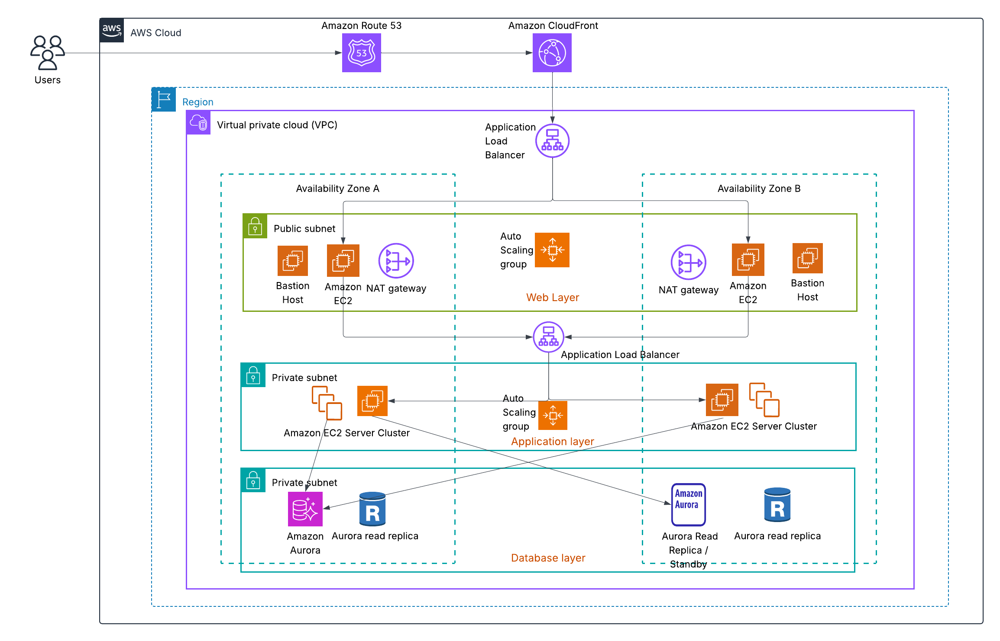
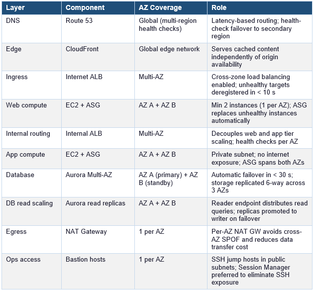

# Marin Erdelji

**IT Infrastructure & Solutions Architecture**

I'm an IT Infrastructure Engineer actively working on AWS solution architecture designs, cloud engineering and DevOps projects.

Focus areas:

- Designing scalable, highly available, and resilient architectures aligned with AWS Well-Architected principles  
- Cloud migration and modernization strategies (rehost, replatform, refactor)  
- Building distributed, event-driven, and microservices-based systems  
- Cost optimization and performance efficiency across cloud workloads  
- Translating business requirements into secure, reliable, and scalable technical solutions

You can find more information about me on  [LinkedIn](https://linkedin.com/in/marin-erdelji-6a7914177)

# Projects

A Solutions architect portfolio which includes real-world AWS case studies.

##  Project 1: Highly Available Web Application

### Overview

This project demonstrates a highly available web application architecture on AWS designed to support a SaaS platform with moderate-scale traffic. The architecture focuses on high availability, scalability, and cost efficiency while maintaining operational simplicity.

### Business Scenario

The application serves a public-facing product, where unpredictable traffic spikes are common — driven by marketing campaigns, seasonal demand, or viral content. The previous single-server deployment experienced outages during peak traffic and required manual intervention to recover from infrastructure failures. The business required a re-architecture that could absorb sudden load increases, survive AZ-level failures automatically, and reduce operational load.

The business requires:
- High availability (99.95%)
- Scalability to handle traffic spikes
- Cost-conscious design
- Secure and maintainable infrastructure

 **Stakeholders**

Engineering team -   Own deployments, instance types, and application configuration  

Platform / SRE team -   Own infrastructure, scaling policies, and disaster recovery runbooks  

Finance -   Require cost predictability; auto-scaling must have defined upper limits  

  ### Problem

The current single-instance architecture creates a single point of failure and cannot handle traffic spikes effectively. Any instance or availability zone failure results in downtime, impacting user experience and revenue.

### Solution

The solution implements a multi-tier, highly available architecture across multiple availability zones using managed AWS services. It’s designed to expand and contract automatically
in response to the application’s needs, ensuring users experience consistent, responsive performance.
When users access and interact to the application using website or mobile application. Their requests
are routed through Amazon Route 53, which is a highly available and scalable Domain Name System
(DNS) web service. Amazon CloudFront, a CDN, is used to distribute static content like images,
stylesheets, and JavaScript files efficiently. This design ensures resilience, scalability, and operational efficiency while maintaining cost control.

### Highly Available Web Application Diagram:
 

## Architectural Flow

User requests travel through a layered set of AWS services. The flow is deterministic, with health-check-based routing at every layer boundary.
## Inbound Request Flow Explanation

1. **DNS resolution**  
   The user's browser resolves the domain via Route 53. A latency-based routing policy returns the Regional ALB endpoint. Route 53 health checks can fail over to a secondary region if configured.

2. **Edge caching**  
   The request hits CloudFront. Static assets are served from the nearest edge location with no origin round-trip. Dynamic requests are forwarded to the internet-facing ALB.

3. **Internet-facing ALB**  
   The Application Load Balancer receives HTTPS traffic, inspects host and path-based routing rules, and forwards requests to the target group of EC2 web layer instances. Health checks deregister unhealthy instances in < 10 seconds.

4. **Web layer (public subnet, AZ A + B)**  
   EC2 instances in the Auto Scaling Group serve the web layer. Each AZ hosts a bastion host for SSH access and a NAT Gateway providing outbound internet access for private-subnet instances. The web layer forwards application logic requests to the internal ALB.

5. **Internal ALB**  
    A second Application Load Balancer sits between the web and application layers, entirely within the VPC. It distributes requests across the private-subnet EC2 application server clusters in both AZs.

6. **Application layer (private subnet, AZ A + B)**  
    EC2 server clusters handle business logic. Instances are in private subnets with no inbound internet route. Outbound traffic (software updates, third-party API calls) exits through the NAT Gateway in the same AZ to avoid cross-AZ data transfer costs.

7. **Database layer (private subnet, AZ A + B)**  
    The application tier connects to the Aurora cluster endpoint (writer) for transactional writes and to the reader endpoint for read queries. Aurora Database is deployed with a primary writer in AZ A and a standby / read replica in AZ B. Additional read replicas in each AZ provide increased read throughput under load.

### High Availability Design

High availability is achieved by eliminating single points of failure at every layer. The table below maps each tier to its HA mechanism.

 

### Scaling Strategy

Both the web and application tiers scale independently using EC2 Auto Scaling Groups, with load-based policies responding to CPU utilisation and ALB request count. Scaling policies are tiered: a target tracking policy handles gradual load increases, while a scheduled scaling action pre-warms capacity for known traffic patterns such as business-hours ramp-up. CloudFront further reduces origin load through edge caching, so Auto Scaling responds to genuine application demand rather than servicing avoidable repeat requests. Aurora supports read scaling through read replicas, offloading query volume from the writer instance as the application tier scales out.

### Disaster Recovery Considerations

The architecture is designed for resilience against AZ-level failures within a single region. This covers the vast majority of real-world incidents, including hardware failures, power events, and network partitions within an AZ.

- Current design supports high availability within a single region
- Recovery from instance and AZ failures is automatic
- Future improvement: warm standby deployment in secondary region
- RTO: minutes, RPO: minimal due to Aurora replication

### Trade-offs

**EC2 + ASG over containers (ECS/EKS)**  

- EC2 instances have slower scale-out (~3 min) versus ECS tasks (~30 s); higher per-instance cost at low utilisation

The application is a traditional web app not yet containerised. EC2 ASG is simpler to operate and debug; containerisation is a roadmap item. At current traffic volumes the 3-minute scale lag is within SLA.

**Two AZs over three**

- Two AZs provides 99.95% availability; three AZs would provide additional resilience for simultaneous multi-AZ events

Three AZs increases minimum running instance count by 50% (3 vs 2 minimum instances per tier), raising baseline cost. For this workload, two AZs satisfies the 99.95% SLA. Three AZs is the recommended upgrade at higher traffic tiers.

**Single-region over multi-region active-active**

- A full AWS regional outage would result in complete application unavailability with an RTO of > 2 hours (time to redeploy from IaC and restore Aurora from snapshot in a secondary region)

Multi-region active-active adds significant operational complexity (global Aurora, Route 53 geolocation, cross-region latency considerations) and roughly doubles infrastructure cost. The current workload's business requirements do not demand sub-5-minute RTO for a full region failure. This is an explicitly accepted risk with a documented upgrade path.

**Aurora PostgreSQL over DynamoDB**

- Aurora requires schema design, migration management, and a minimum provisioned instance cost, it does not scale to zero and adds operational overhead versus a fully serverless key-value store
  
The application has relational data with joins, foreign-key constraints, and reporting queries (aggregations, group by, multi-table joins) that are natural in SQL and complex or cost-prohibitive in DynamoDB. Aurora also supports transactions (ACID) across multiple tables, which DynamoDB requires careful design to approximate. For a reporting-heavy workload, the relational model is the correct fit.

**NAT Gateway per AZ over shared NAT Gateway** 

- Two NAT Gateways cost approx double then single shared NAT GW (~$32/month vs ~$16/month plus data processing)

A single NAT GW is a cross-AZ single point of failure. If the NAT GW's AZ fails, the other AZ's instances lose all outbound internet access. The cost delta is small relative to the availability risk eliminated.

**Bastion hosts over Session Manager only** 

- Bastion hosts are EC2 instances that must be patched, monitored, and secured; they represent a management attack surface

Some legacy tooling requires SSH. Bastion hosts are included but intentionally minimised (t3.micro, no persistent storage). Session Manager is the stated preferred path and will replace bastions on the roadmap.

### Security Considerations

Network isolation is the first line of defence. All user traffic enters through the internet-facing Application Load Balancer, which sits in the public subnet and acts as the sole ingress point. The database layer goes a step further — Aurora is isolated in a dedicated private subnet with no NAT Gateway egress, meaning it has no outbound internet path either. This ensures the database can only receive connections from within the VPC, and specifically only from the application tier.

Security groups enforce least-privilege tier-by-tier access. Rather than opening ports to broad CIDR ranges, each tier's security group references the security group ID of the tier above it as the source rule. The internet-facing ALB accepts HTTPS (443) from 0.0.0.0/0; the web tier EC2 instances accept only from the ALB security group; the internal ALB accepts only from the web tier security group; the application tier accepts only from the internal ALB security group; and Aurora accepts only from the application tier security group. This chain means a compromised web instance cannot directly reach the database — it would first need to traverse the internal ALB and application tier, both of which apply independent health checks and connection validation.

IAM roles replace static credentials throughout. No access keys are stored on EC2 instances, in environment variables, or in application configuration files. Instead, EC2 instance profiles attach IAM roles that grant the minimum permissions required. This eliminates the credential rotation burden and removes the risk of long-lived keys being leaked through application logs or source code.

AWS WAF provides an optional but strongly recommended edge security layer. Attaching WAF to the CloudFront distribution and the internet-facing ALB allows request inspection before traffic reaches any EC2 compute. WAF rate limiting rules also serve as the first line of defence against application-layer DDoS, throttling abusive source IPs before they consume ALB or EC2 capacity.

Bastion hosts, while placed in public subnets for SSH access, represent a residual attack surface. The forward path is to replace them entirely with AWS Systems Manager Session Manager, which provides audited shell access over HTTPS with no open inbound port — eliminating the need for port 22 to be reachable from the internet at all.

