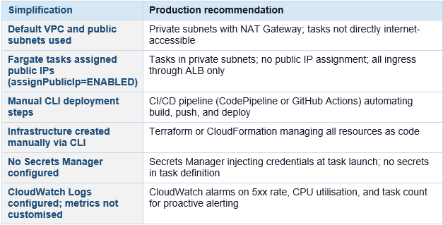

# Marin Erdelji

**IT Infrastructure & Solutions Architecture**

I'm an IT Infrastructure Engineer actively working on AWS solution architecture designs, cloud engineering and DevOps projects.

Focus areas:

- Designing scalable, highly available, and resilient architectures aligned with AWS Well-Architected principles  
- Cloud migration and modernization strategies (rehost, replatform, refactor)  
- Building distributed, event-driven, and microservices-based systems  
- Cost optimization and performance efficiency across cloud workloads  
- Translating business requirements into secure, reliable, and scalable technical solutions

You can find more information about me on  [LinkedIn](https://linkedin.com/in/marin-erdelji-6a7914177)

# Projects

A Solutions architect portfolio which includes real-world AWS case studies.

##  Project 1: Highly Available Web Application

### Overview

This project demonstrates a highly available web application architecture on AWS designed to support a SaaS platform with moderate-scale traffic. The architecture focuses on high availability, scalability, and cost efficiency while maintaining operational simplicity.

### Business Scenario

The application serves a public-facing product, where unpredictable traffic spikes are common — driven by marketing campaigns, seasonal demand, or viral content. The previous single-server deployment experienced outages during peak traffic and required manual intervention to recover from infrastructure failures. The business required a re-architecture that could absorb sudden load increases, survive AZ-level failures automatically, and reduce operational load.

The business requires:
- High availability (99.95%)
- Scalability to handle traffic spikes
- Cost-conscious design
- Secure and maintainable infrastructure

 **Stakeholders**

Engineering team -   Own deployments, instance types, and application configuration  

Platform / SRE team -   Own infrastructure, scaling policies, and disaster recovery runbooks  

Finance -   Require cost predictability; auto-scaling must have defined upper limits  

  ### Problem

The current single-instance architecture creates a single point of failure and cannot handle traffic spikes effectively. Any instance or availability zone failure results in downtime, impacting user experience and revenue.

### Solution

The solution implements a multi-tier, highly available architecture across multiple availability zones using managed AWS services. It’s designed to expand and contract automatically
in response to the application’s needs, ensuring users experience consistent, responsive performance.
When users access and interact to the application using website or mobile application. Their requests
are routed through Amazon Route 53, which is a highly available and scalable Domain Name System
(DNS) web service. Amazon CloudFront, a CDN, is used to distribute static content like images,
stylesheets, and JavaScript files efficiently. This design ensures resilience, scalability, and operational efficiency while maintaining cost control.

### Highly Available Web Application Diagram:
 

## Architecture Flow

User requests travel through a layered set of AWS services. The flow is deterministic, with health-check-based routing at every layer boundary.
## Inbound Request Flow Explanation

1. **DNS resolution**  
   The user's browser resolves the domain via Route 53. A latency-based routing policy returns the Regional ALB endpoint. Route 53 health checks can fail over to a secondary region if configured.

2. **Edge caching**  
   The request hits CloudFront. Static assets are served from the nearest edge location with no origin round-trip. Dynamic requests are forwarded to the internet-facing ALB.

3. **Internet-facing ALB**  
   The Application Load Balancer receives HTTPS traffic, inspects host and path-based routing rules, and forwards requests to the target group of EC2 web layer instances. Health checks deregister unhealthy instances in < 10 seconds.

4. **Web layer (public subnet, AZ A + B)**  
   EC2 instances in the Auto Scaling Group serve the web layer. Each AZ hosts a bastion host for SSH access and a NAT Gateway providing outbound internet access for private-subnet instances. The web layer forwards application logic requests to the internal ALB.

5. **Internal ALB**  
    A second Application Load Balancer sits between the web and application layers, entirely within the VPC. It distributes requests across the private-subnet EC2 application server clusters in both AZs.

6. **Application layer (private subnet, AZ A + B)**  
    EC2 server clusters handle business logic. Instances are in private subnets with no inbound internet route. Outbound traffic (software updates, third-party API calls) exits through the NAT Gateway in the same AZ to avoid cross-AZ data transfer costs.

7. **Database layer (private subnet, AZ A + B)**  
    The application tier connects to the Aurora cluster endpoint (writer) for transactional writes and to the reader endpoint for read queries. Aurora Database is deployed with a primary writer in AZ A and a standby / read replica in AZ B. Additional read replicas in each AZ provide increased read throughput under load.

### High Availability Design

High availability is achieved by eliminating single points of failure at every layer. The table below maps each tier to its HA mechanism.

 

### Scaling Strategy

Both the web and application tiers scale independently using EC2 Auto Scaling Groups, with load-based policies responding to CPU utilisation and ALB request count. Scaling policies are tiered: a target tracking policy handles gradual load increases, while a scheduled scaling action pre-warms capacity for known traffic patterns such as business-hours ramp-up. CloudFront further reduces origin load through edge caching, so Auto Scaling responds to genuine application demand rather than servicing avoidable repeat requests. Aurora supports read scaling through read replicas, offloading query volume from the writer instance as the application tier scales out.

### Disaster Recovery Considerations

The architecture is designed for resilience against AZ-level failures within a single region. This covers the vast majority of real-world incidents, including hardware failures, power events, and network partitions within an AZ.

- Current design supports high availability within a single region
- Recovery from instance and AZ failures is automatic
- Future improvement: warm standby deployment in secondary region
- RTO: minutes, RPO: minimal due to Aurora replication

### Trade-offs

**EC2 + ASG over containers (ECS/EKS)**  

- EC2 instances have slower scale-out (~3 min) versus ECS tasks (~30 s); higher per-instance cost at low utilisation

The application is a traditional web app not yet containerised. EC2 ASG is simpler to operate and debug; containerisation is a roadmap item. At current traffic volumes the 3-minute scale lag is within SLA.

**Two AZs over three**

- Two AZs provides 99.95% availability; three AZs would provide additional resilience for simultaneous multi-AZ events

Three AZs increases minimum running instance count by 50% (3 vs 2 minimum instances per tier), raising baseline cost. For this workload, two AZs satisfies the 99.95% SLA. Three AZs is the recommended upgrade at higher traffic tiers.

**Single-region over multi-region active-active**

- A full AWS regional outage would result in complete application unavailability with an RTO of > 2 hours (time to redeploy from IaC and restore Aurora from snapshot in a secondary region)

Multi-region active-active adds significant operational complexity (global Aurora, Route 53 geolocation, cross-region latency considerations) and roughly doubles infrastructure cost. The current workload's business requirements do not demand sub-5-minute RTO for a full region failure. This is an explicitly accepted risk with a documented upgrade path.

**Aurora PostgreSQL over DynamoDB**

- Aurora requires schema design, migration management, and a minimum provisioned instance cost, it does not scale to zero and adds operational overhead versus a fully serverless key-value store
  
The application has relational data with joins, foreign-key constraints, and reporting queries (aggregations, group by, multi-table joins) that are natural in SQL and complex or cost-prohibitive in DynamoDB. Aurora also supports transactions (ACID) across multiple tables, which DynamoDB requires careful design to approximate. For a reporting-heavy workload, the relational model is the correct fit.

**NAT Gateway per AZ over shared NAT Gateway** 

- Two NAT Gateways cost approx double then single shared NAT GW (~$32/month vs ~$16/month plus data processing)

A single NAT GW is a cross-AZ single point of failure. If the NAT GW's AZ fails, the other AZ's instances lose all outbound internet access. The cost delta is small relative to the availability risk eliminated.

**Bastion hosts over Session Manager only** 

- Bastion hosts are EC2 instances that must be patched, monitored, and secured; they represent a management attack surface

Some legacy tooling requires SSH. Bastion hosts are included but intentionally minimised (t3.micro, no persistent storage). Session Manager is the stated preferred path and will replace bastions on the roadmap.

### Security Considerations

Network isolation is the first line of defence. All user traffic enters through the internet-facing Application Load Balancer, which sits in the public subnet and acts as the sole ingress point. The database layer goes a step further — Aurora is isolated in a dedicated private subnet with no NAT Gateway egress, meaning it has no outbound internet path either. This ensures the database can only receive connections from within the VPC, and specifically only from the application tier.

Security groups enforce least-privilege tier-by-tier access. Rather than opening ports to broad CIDR ranges, each tier's security group references the security group ID of the tier above it as the source rule. The internet-facing ALB accepts HTTPS (443) from 0.0.0.0/0; the web tier EC2 instances accept only from the ALB security group; the internal ALB accepts only from the web tier security group; the application tier accepts only from the internal ALB security group; and Aurora accepts only from the application tier security group. This chain means a compromised web instance cannot directly reach the database — it would first need to traverse the internal ALB and application tier, both of which apply independent health checks and connection validation.

IAM roles replace static credentials throughout. No access keys are stored on EC2 instances, in environment variables, or in application configuration files. Instead, EC2 instance profiles attach IAM roles that grant the minimum permissions required. This eliminates the credential rotation burden and removes the risk of long-lived keys being leaked through application logs or source code.

AWS WAF provides an optional but strongly recommended edge security layer. Attaching WAF to the CloudFront distribution and the internet-facing ALB allows request inspection before traffic reaches any EC2 compute. WAF rate limiting rules also serve as the first line of defence against application-layer DDoS, throttling abusive source IPs before they consume ALB or EC2 capacity.

Bastion hosts, while placed in public subnets for SSH access, represent a residual attack surface. The forward path is to replace them entirely with AWS Systems Manager Session Manager, which provides audited shell access over HTTPS with no open inbound port — eliminating the need for port 22 to be reachable from the internet at all.

### Future Improvements

**Short-Term (0-6 months)**

Replace Bastion hosts with Session Manager: Eliminate SSH port 22 entirely. Use AWS Systems Manager Session Manager for all instance access — removing the bastion EC2 instances, their security groups, and their patch lifecycle. Reduces attack surface and operational burden.

Attach WAF to CloudFront and internet-facing ALB: AWS WAF with managed rule groups (Core rule set, Known bad inputs, SQL injection) adds a critical security layer currently absent from the architecture. Rate limiting rules protect against application-layer DDoS.

ElastiCache (Redis) read-through cache: Add an ElastiCache Redis cluster (Multi-AZ, 2 nodes) between the application tier and Aurora. Cache session state, frequently read database objects, and API responses. Target: 60-70% cache hit rate reducing Aurora load and improving application latency.

ALB access logs to S3 + Athena: Enable ALB access logs to an S3 bucket and query with Athena for ad-hoc traffic analysis. Foundation for anomaly detection and capacity planning.

**Medium-Term (6-18 months)**

Containerise application tier (ECS Fargate): Migrate the app tier from EC2 ASG to ECS Fargate tasks. Benefits: faster scale-out (~30 seconds versus ~3 minutes), no AMI management, per-task resource billing, and cleaner deployment pipelines. The web tier can follow once the app tier is validated.

Three-AZ expansion: Add a third Availability Zone to both the web and application Auto Scaling groups and add a second Aurora read replica. Reduces the blast radius of simultaneous AZ events and provides additional headroom for rolling deployments without reducing capacity below the minimum.

CDN strategy for dynamic content: Implement CloudFront behaviours for short-TTL caching of semi-dynamic API responses (e.g., product catalogues, pricing). Target: reduce origin hit rate by a further 20-30% on top of static asset caching.

**Long-Term (18+ months)**

Multi-region active-passive (pilot light): Deploy a pilot-light stack in a second region: Aurora Global Database secondary cluster (sub-second replication lag), S3 cross-region replication, and a dormant CloudFormation stack deployable within 15 minutes. Reduces full-region RTO from > 2 hours to < 15 minutes without the cost of a full active-active deployment.

Service mesh and microservices decomposition: As the application grows, decompose the monolithic app tier into independently scalable services behind an internal Application Load Balancer or API Gateway. AWS App Mesh or Amazon VPC Lattice enables service-to-service mTLS, traffic shaping, and per-service observability.

Infrastructure cost optimisation programme: Purchase 1-year Compute Savings Plans for the validated baseline instance count after 6 months of production traffic data. Introduce Spot Instance mixed fleets for the web tier (stateless, tolerant of interruption) targeting 40-50% compute cost reduction.

### Key Outcomes

The multi-AZ design across both the web and application tiers, combined with Aurora's automatic failover, positions the architecture to meet a 99.95% availability target while eliminating any single point of failure. Horizontal scalability is built into every compute tier through EC2 Auto Scaling Groups, allowing the system to absorb sudden traffic spikes without manual intervention and scale back down during quiet periods to control cost. The three-tier network isolation model, IAM-based credential management, and ALB-enforced security group chaining reduce the blast radius of any individual component failure or security event. Overall, the architecture balances operational simplicity — using managed services at every tier boundary to reduce toil, with the performance and resilience characteristics expected of a production public-facing web application.

##  Project 2: Containerized Application Platform

### Overview
This project demonstrates how to package and deploy a web application using Docker and AWS container services. The architecture moves away from instance-centric thinking where applications are tied to specific servers toward a container-native model where the application is packaged as an immutable image, stored in a managed registry, and run by a managed compute service that handles infrastructure placement transparently.

### Business Scenario
This project simulates a modern containerized web application platform for a SaaS workload. The goal is to package the application into a portable container image and deploy it using managed container services on AWS. The architecture is designed to simplify deployment, improve consistency across environments, and provide a foundation for scalable cloud-native workloads. Traditional EC2-based deployments require manual AMI management, OS patching, dependency installation, and environment-specific configuration. As teams and deployment frequency grow, these concerns compound leading to configuration drift, unreliable deployments, and slow onboarding for new engineers. Containerisation addresses all three by codifying the application environment in a Dockerfile that is version-controlled alongside the application code.

### Problem Being Solved
•	**Environment inconsistency:** applications that behave differently in development versus production due to differing OS versions, library versions, or manual configuration steps.

•	**Slow, manual deployments:** SSH-based deployments to EC2 instances that require coordinated human intervention and have no rollback mechanism.

•	**Tight coupling to infrastructure:** applications that cannot be moved between environments or cloud providers without significant rework.

•	**Operational overhead:** engineering time spent patching operating systems and managing server state rather than shipping features.

### Solution Summary

The application is containerised with Docker, producing an immutable image pushed to Amazon ECR. ECS Fargate runs the containers without requiring any EC2 instance management. An Application Load Balancer distributes traffic to Fargate tasks and performs health checks. CloudWatch Logs captures all container output for observability. The result is a deployment pipeline that is repeatable, auditable, and operable by a small team.

### Implementation Scope
This implementation uses the default VPC and public subnets for deployment simplicity. Fargate tasks are assigned public IPs. This is an intentional trade-off to reduce complexity while demonstrating core containerization and ECS deployment principles. Production recommendations — private subnets, NAT Gateway, Secrets Manager — are documented throughout and in the Future Improvements section.

 

### Objectives

1. **Containerize the web application**  
   Using Docker, produce a minimal, reproducible image with all runtime dependencies included.

2. **Validate locally**  
   Run the container on a development machine to confirm the image behaves identically to the non-containerized application.

3. **Store the image in Amazon ECR**  
   Provide a private, managed container registry with built-in vulnerability scanning and IAM-based access control.

4. **Deploy to Amazon ECS Fargate**  
   Run the container as a managed task with no EC2 instances to provision, patch, or scale.

5. **Expose the application via ALB**  
   Enable HTTPS termination, health-check-based routing, and a stable DNS endpoint independent of individual task IPs.

6. **Establish observability**  
   Use CloudWatch Logs to capture all container output for debugging and audit.

7. **Demonstrate cloud-native deployment practices**  
   Provide a foundation for CI/CD integration, auto-scaling, and infrastructure-as-code in future iterations.

### Architecture
The architecture uses a public-facing ALB as the single entry point, routing traffic to ECS Fargate tasks running in public subnets across two Availability Zones. Images are pulled from ECR at task launch. All container output streams to CloudWatch Logs automatically via the awslogs driver.

[Add diagram later]

## Architecture Flow

The following steps describe the full request lifecycle from image build through to response delivery.

1. **Image build and push**  
   The developer builds the Docker image locally and tags it. The image is pushed to the Amazon ECR private repository using the AWS CLI. ECR stores the versioned image and runs an automated vulnerability scan on push.

2. **ALB receives user request**  
   A user sends an HTTP request to the Application Load Balancer DNS endpoint. The ALB listener evaluates routing rules and forwards the request to the registered ECS target group.
3. **Target group routes to Fargate task**  
   The ALB target group selects a healthy Fargate task registered against it. The ALB performs health checks on the container health endpoint; unhealthy tasks are deregistered automatically.

4. **ECS Fargate runs the task**  
   The ECS service maintains the desired task count across both Availability Zones. Fargate pulls the container image from ECR, starts the container, and maps the application port (3000) to the ALB target group port.

5. **Container processes the request**  
    The running container handles the HTTP request on port 3000 and returns a response through the ALB back to the user.

6. **Logs delivered to CloudWatch**  
    All container stdout and stderr are forwarded in real time to the CloudWatch Log Group via the awslogs log driver configured in the ECS task definition. Log streams are named per task for easy correlation.

### AWS Services Used

- Amazon ECS Fargate - Runs containerized tasks without EC2 instance management. Handles placement, networking, and task lifecycle. Scales task count independently of infrastructure.
- Amazon ECR - Private Docker registry with IAM access control, image versioning, and automated vulnerability scanning on every push.
- Application Load Balancer - Routes HTTP traffic to ECS Fargate tasks. Performs health checks and deregisters unhealthy tasks automatically. Provides a stable DNS endpoint.
- Amazon VPC - Default VPC used for this implementation. Public subnets host both the ALB and ECS tasks. In production, tasks would move to private subnets.
- AWS IAM - Execution role grants ECS permission to pull images from ECR and deliver logs to CloudWatch. Task role grants runtime application access to required AWS APIs only.
- Amazon CloudWatch Logs - Captures all container stdout/stderr via the awslogs log driver. Enables log search and retention management without application-side logging infrastructure.
- AWS CloudWatch Metrics - ECS and ALB metrics (CPU, memory, request count, 5xx rate) are available natively. Alarms and dashboards not yet configured — planned as a future improvement.
- AWS Secrets Manager - Not used in this implementation. Recommended for production to inject database credentials and API keys at task launch rather than embedding them in the task definition.
  
### Key Decisions & Trade-offs

**ECS over EKS**  

- ECS does not provide the Kubernetes API surface — no Helm charts, no custom operators, no multi-cluster federation.

EKS adds significant operational complexity: control plane management, node group upgrades, networking add-ons (CNI, CoreDNS), and a steeper learning curve. For a SaaS web application that does not require Kubernetes-native features, ECS provides 90% of the capability at a fraction of the operational overhead. EKS is the right evolution if the workload grows to dozens of microservices with complex inter-service dependencies.

**Fargate over EC2 launch type**

- Fargate has a higher per-vCPU/hour cost than equivalent EC2 instances; does not support GPU workloads or privileged containers

EC2 launch type requires managing EC2 instances: patching, capacity planning, cluster scaling, and potential bin-packing inefficiency. Fargate eliminates all of this — ECS manages placement, the underlying host is never visible, and billing is per-task-second. For a web application without GPU or privileged container requirements, Fargate is the correct default.

**Containers over EC2-only deployment**

- Containerisation adds a build step, requires Docker knowledge, and introduces a container registry as a dependency in the deployment pipeline.

Without containerisation, the application's runtime environment is defined by whatever is installed on the EC2 AMI — leading to environment drift across machines, difficult rollbacks, and slow onboarding. The container image is a self-contained, versioned, auditable deployment unit that can be promoted through environments (dev, staging, prod) without modification.

**Public subnets (this implementation)**

- Fargate tasks are assigned public IPs, directly reachable from the internet if security group rules are misconfigured
  
Chosen to reduce deployment complexity for a portfolio implementation. Security groups restrict all inbound task access to the ALB security group only. Private subnets with NAT Gateway is the documented production path.

**Manual CLI deployment (this implementation)** 

- No automated testing gate; deployment is a manual multi-step process with no rollback automation
  
Acceptable for initial portfolio deployment. The manual steps are documented and repeatable. CI/CD via GitHub Actions or CodePipeline is the first roadmap item — each manual step maps directly to a pipeline stage.

### Security Considerations

Security controls are applied at the network, identity, and image layers. Some production-grade controls are not yet implemented and are called out explicitly.

**Implemented Controls**

- **Security group least-privilege:** the ALB security group accepts HTTP/HTTPS from 0.0.0.0/0; the Fargate task security group accepts traffic only from the ALB security group on the container port. No direct public access to task IPs is permitted through the security group rules.
- **IAM execution role:** grants ECS the minimum permissions required — ECR image pull and CloudWatch Logs delivery. No wildcard permissions. The task role is separate and scoped to the application's runtime API requirements only.
- **ECR private registry:** the container image is stored in a private ECR repository, not a public registry. Image pull requires IAM authentication.
- **ECR vulnerability scanning:** automated scan runs on every image push. Scan results are reviewed before the image is promoted to the ECS service.

**Recommended for Production**

- **Private subnets + NAT Gateway:** move Fargate tasks to private subnets so task IPs are never directly routable from the internet, regardless of security group configuration.
- **AWS Secrets Manager:** inject database credentials and API keys as environment variables at task launch. Eliminates the need to store secrets in the task definition or application environment files.
- **Immutable ECR image tags:** enable tag immutability in ECR to prevent silent tag reassignment. Production deployments should reference image SHA256 digests, not mutable tags.
- **AWS WAF:** attach WAF to the ALB with the Core Rule Set and rate limiting rules to protect against OWASP Top 10 vulnerabilities and application-layer DDoS.

### Observability

**Logging — Implemented**
Every Fargate task is configured with the awslogs log driver, forwarding all container stdout and stderr to a CloudWatch Log Group. Log streams are named per task, enabling straightforward correlation between a specific container instance and its output. This was the primary debugging tool during deployment and the root cause of the ResourceInitializationError described in Debugging & Lessons Learned Section.

**Metrics — Available, Not Yet Configured**
CloudWatch Metrics are available natively for ECS (CPU utilisation, memory utilisation, running task count) and ALB (RequestCount, TargetResponseTime, HTTPCode_Target_5XX_Count). These metrics are not yet surfaced in a dashboard or tied to alarms. Configuring alarms on 5xx rate and task count is the immediate next observability step.

### Debugging & Lessons Learned
This section documents a real incident encountered during deployment. 

**Incident: ECS Tasks Failing to Start**
Issue: ResourceInitializationError
During initial deployment, ECS tasks repeatedly failed to start and never registered in the ALB target group, resulting in zero healthy targets and no traffic reaching the application.

**Root Cause**
The CloudWatch Log Group referenced in the ECS task definition did not exist in the correct AWS region. The awslogs log driver attempts to create or write to the log group at container startup. When the log group is absent or in a different region, the container runtime fails before the application process starts, producing a ResourceInitializationError.

**Resolution Steps**
1. Created the CloudWatch Log Group in the correct AWS region matching the ECS cluster region.
2. Registered a new ECS task definition revision with the corrected log group configuration.
3. Recreated the ECS service referencing the new task definition revision.
4. Confirmed tasks reached RUNNING state and registered as healthy in the ALB target group.

   
### Future Improvements

**Short-Term (0-3 months)**

CI/CD pipeline: Implement an automated pipeline (AWS CodePipeline + CodeBuild, or GitHub Actions) that builds the Docker image on every commit, runs automated tests, pushes to ECR on success, and triggers an ECS rolling deployment. This removes all manual steps from the deployment path and adds a quality gate before production.

ECS Service Auto Scaling: Configure target tracking on ALB RequestCountPerTarget and a step scaling policy on CPU utilisation. Set a maximum task count to cap spend. This converts the deployment from fixed-capacity to demand-responsive.

ECR lifecycle policies: Define lifecycle rules to automatically expire untagged images older than 7 days and retain only the last 10 tagged releases. Prevents ECR storage costs from accumulating with stale images.

**Medium-Term (3-12 months)**

Infrastructure as Code (Terraform): Migrate all AWS resources — VPC, subnets, security groups, ALB, ECS cluster, task definition, IAM roles, CloudWatch Log Groups — into Terraform modules. This makes the entire environment version-controlled, reviewable, and reproducible in any AWS account within minutes. Terraform state stored in S3 with DynamoDB locking.

Multi-environment promotion: Extend the CI/CD pipeline to support dev, staging, and production environments as separate ECS clusters (or services within the same cluster). Promotion between environments is triggered by a manual approval gate in the pipeline, not by direct deployment.

Container image hardening: Adopt a minimal base image (e.g., distroless or Alpine), run the container process as a non-root user, and enable read-only root filesystem in the task definition. Schedule weekly ECR image rescans and integrate scan results into the CI/CD pipeline as a deployment gate.

**Long-Term (12+ months)**

Multi-region active-passive: Deploy an identical ECS service in a second AWS region. Use Route 53 health-check-based failover to route traffic to the secondary region if the primary ALB health check fails. Aurora Global Database or RDS read replica provides data in the secondary region with sub-second replication lag.

### Key Outcomes

Containerising the application and deploying to ECS Fargate eliminates the environment inconsistency and manual operational overhead that characterised the previous EC2-based approach — every deployment is now a deterministic promotion of a versioned, scanned image rather than a manual configuration change applied to a live server. The Fargate model removes EC2 instance management entirely, reducing the operational surface to the application and its configuration while AWS handles placement, patching, and host-level availability. The multi-AZ ALB and minimum two-task ECS service configuration provides resilience against both individual task failures and AZ-level events without any manual intervention. The architecture also establishes a clear and incremental upgrade path: CI/CD, auto-scaling, and Terraform are the immediate next steps, each buildable independently without rearchitecting what is already in place.

