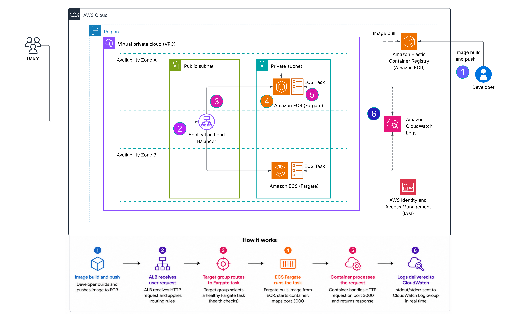
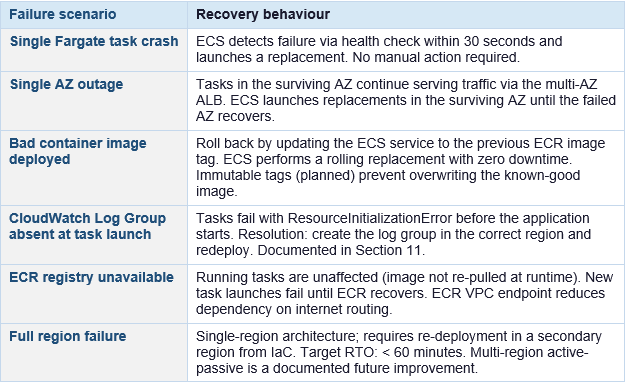
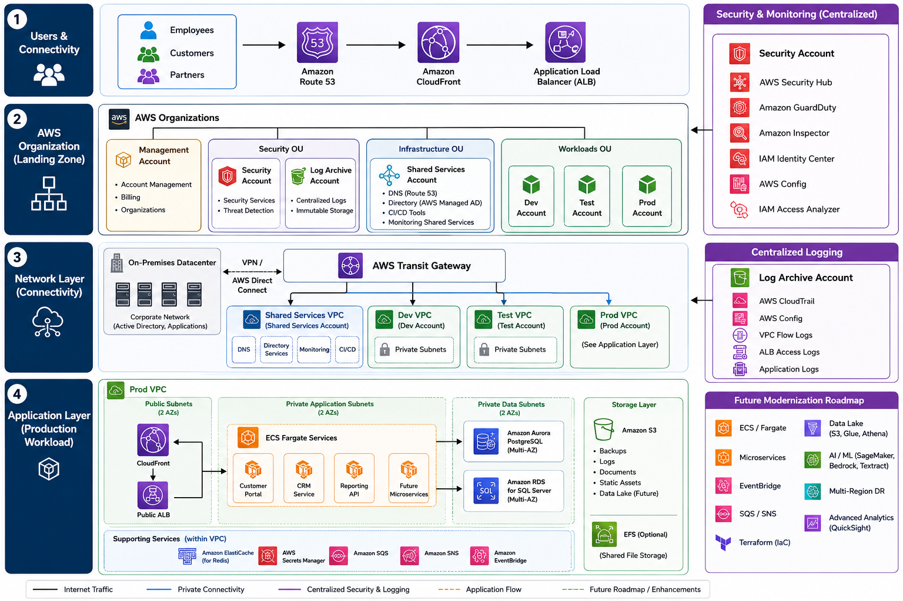

# Marin Erdelji

**IT Infrastructure & Solutions Architecture**

I'm an IT Infrastructure professional with 8 years of experience transitioning into AWS Solutions Architecture

Focus areas:

- Designing scalable, highly available, and resilient architectures aligned with AWS Well-Architected principles  
- Cloud migration and modernization strategies (rehost, replatform, refactor)  
- Building distributed, event-driven, and microservices-based systems  
- Cost optimization and performance efficiency across cloud workloads  
- Translating business requirements into secure, reliable, and scalable technical solutions

You can find more information about me on  [LinkedIn](https://linkedin.com/in/marin-erdelji-6a7914177)

<a href="https://www.credly.com/badges/ee6120e3-34f4-4e65-a63e-ddc6bd82cef8/public_url">

</a>

<a href="https://learn.microsoft.com/api/credentials/share/en-us/Marin-7436/18FB9D0A8069C5D0?sharingId=87ADDC395A7EF8D1">

</a>

<a href="#">

</a>

<a href="https://www.credly.com/badges/89e6d395-1527-4e01-a1fa-09db069caf54/email">

</a>


# Projects

A Solutions architect portfolio which includes real-world AWS case studies.

##  Project 1: Highly Available Web Application

### Overview

This project demonstrates a highly available web application architecture on AWS designed to support a SaaS platform with moderate-scale traffic. The architecture focuses on high availability, scalability, and cost efficiency while maintaining operational simplicity.

### Business Scenario

The application serves a public-facing product, where unpredictable traffic spikes are common — driven by marketing campaigns, seasonal demand, or viral content. The previous single-server deployment experienced outages during peak traffic and required manual intervention to recover from infrastructure failures. The business required a re-architecture that could absorb sudden load increases, survive AZ-level failures automatically, and reduce operational load.

The business requires:
- High availability (99.95%)
- Scalability to handle traffic spikes
- Cost-conscious design
- Secure and maintainable infrastructure

 **Stakeholders**

Engineering team -   Own deployments, instance types, and application configuration  

Platform / SRE team -   Own infrastructure, scaling policies, and disaster recovery runbooks  

Finance -   Require cost predictability; auto-scaling must have defined upper limits  


  ### Problem

The current single-instance architecture creates a single point of failure and cannot handle traffic spikes effectively. Any instance or availability zone failure results in downtime, impacting user experience and revenue.

### Solution

The solution implements a multi-tier, highly available architecture across multiple availability zones using managed AWS services. It’s designed to expand and contract automatically
in response to the application’s needs, ensuring users experience consistent, responsive performance.
When users access and interact to the application using website or mobile application. Their requests
are routed through Amazon Route 53, which is a highly available and scalable Domain Name System
(DNS) web service. Amazon CloudFront, a CDN, is used to distribute static content like images,
stylesheets, and JavaScript files efficiently. This design ensures resilience, scalability, and operational efficiency while maintaining cost control.

### Highly Available Web Application Diagram:
 

## Architecture Flow

User requests travel through a layered set of AWS services. The flow is deterministic, with health-check-based routing at every layer boundary.
## Inbound Request Flow Explanation

1. **DNS resolution**  
   The user's browser resolves the domain via Route 53. A latency-based routing policy returns the Regional ALB endpoint. Route 53 health checks can fail over to a secondary region if configured.

2. **Edge caching**  
   The request hits CloudFront. Static assets are served from the nearest edge location with no origin round-trip. Dynamic requests are forwarded to the internet-facing ALB.

3. **Internet-facing ALB**  
   The Application Load Balancer receives HTTPS traffic, inspects host and path-based routing rules, and forwards requests to the target group of EC2 web layer instances. Health checks deregister unhealthy instances in < 10 seconds.

4. **Web layer (public subnet, AZ A + B)**  
   EC2 instances in the Auto Scaling Group serve the web layer. Each AZ hosts a bastion host for SSH access and a NAT Gateway providing outbound internet access for private-subnet instances. The web layer forwards application logic requests to the internal ALB.

5. **Internal ALB**  
    A second Application Load Balancer sits between the web and application layers, entirely within the VPC. It distributes requests across the private-subnet EC2 application server clusters in both AZs.

6. **Application layer (private subnet, AZ A + B)**  
    EC2 server clusters handle business logic. Instances are in private subnets with no inbound internet route. Outbound traffic (software updates, third-party API calls) exits through the NAT Gateway in the same AZ to avoid cross-AZ data transfer costs.

7. **Database layer (private subnet, AZ A + B)**  
    The application tier connects to the Aurora cluster endpoint (writer) for transactional writes and to the reader endpoint for read queries. Aurora Database is deployed with a primary writer in AZ A and a standby / read replica in AZ B. Additional read replicas in each AZ provide increased read throughput under load.

### High Availability Design

High availability is achieved by eliminating single points of failure at every layer. The table below maps each tier to its HA mechanism.

 

### Scaling Strategy

Both the web and application tiers scale independently using EC2 Auto Scaling Groups, with load-based policies responding to CPU utilisation and ALB request count. Scaling policies are tiered: a target tracking policy handles gradual load increases, while a scheduled scaling action pre-warms capacity for known traffic patterns such as business-hours ramp-up. CloudFront further reduces origin load through edge caching, so Auto Scaling responds to genuine application demand rather than servicing avoidable repeat requests. Aurora supports read scaling through read replicas, offloading query volume from the writer instance as the application tier scales out.

### Disaster Recovery Considerations

The architecture is designed for resilience against AZ-level failures within a single region. This covers the vast majority of real-world incidents, including hardware failures, power events, and network partitions within an AZ.

- Current design supports high availability within a single region
- Recovery from instance and AZ failures is automatic
- Future improvement: warm standby deployment in secondary region
- RTO: minutes, RPO: minimal due to Aurora replication

### Trade-offs

**EC2 + ASG over containers (ECS/EKS)**  

- EC2 instances have slower scale-out (~3 min) versus ECS tasks (~30 s); higher per-instance cost at low utilisation

The application is a traditional web app not yet containerised. EC2 ASG is simpler to operate and debug; containerisation is a roadmap item. At current traffic volumes the 3-minute scale lag is within SLA.

**Two AZs over three**

- Two AZs provides 99.95% availability; three AZs would provide additional resilience for simultaneous multi-AZ events

Three AZs increases minimum running instance count by 50% (3 vs 2 minimum instances per tier), raising baseline cost. For this workload, two AZs satisfies the 99.95% SLA. Three AZs is the recommended upgrade at higher traffic tiers.

**Single-region over multi-region active-active**

- A full AWS regional outage would result in complete application unavailability with an RTO of > 2 hours (time to redeploy from IaC and restore Aurora from snapshot in a secondary region)

Multi-region active-active adds significant operational complexity (global Aurora, Route 53 geolocation, cross-region latency considerations) and roughly doubles infrastructure cost. The current workload's business requirements do not demand sub-5-minute RTO for a full region failure. This is an explicitly accepted risk with a documented upgrade path.

**Aurora PostgreSQL over DynamoDB**

- Aurora requires schema design, migration management, and a minimum provisioned instance cost, it does not scale to zero and adds operational overhead versus a fully serverless key-value store
  
The application has relational data with joins, foreign-key constraints, and reporting queries (aggregations, group by, multi-table joins) that are natural in SQL and complex or cost-prohibitive in DynamoDB. Aurora also supports transactions (ACID) across multiple tables, which DynamoDB requires careful design to approximate. For a reporting-heavy workload, the relational model is the correct fit.

**NAT Gateway per AZ over shared NAT Gateway** 

- Two NAT Gateways cost approx double then single shared NAT GW (~$32/month vs ~$16/month plus data processing)

A single NAT GW is a cross-AZ single point of failure. If the NAT GW's AZ fails, the other AZ's instances lose all outbound internet access. The cost delta is small relative to the availability risk eliminated.

**Bastion hosts over Session Manager only** 

- Bastion hosts are EC2 instances that must be patched, monitored, and secured; they represent a management attack surface

Some legacy tooling requires SSH. Bastion hosts are included but intentionally minimised (t3.micro, no persistent storage). Session Manager is the stated preferred path and will replace bastions on the roadmap.

### Security Considerations

Network isolation is the first line of defence. All user traffic enters through the internet-facing Application Load Balancer, which sits in the public subnet and acts as the sole ingress point. The database layer goes a step further — Aurora is isolated in a dedicated private subnet with no NAT Gateway egress, meaning it has no outbound internet path either. This ensures the database can only receive connections from within the VPC, and specifically only from the application tier.

Security groups enforce least-privilege tier-by-tier access. Rather than opening ports to broad CIDR ranges, each tier's security group references the security group ID of the tier above it as the source rule. The internet-facing ALB accepts HTTPS (443) from 0.0.0.0/0; the web tier EC2 instances accept only from the ALB security group; the internal ALB accepts only from the web tier security group; the application tier accepts only from the internal ALB security group; and Aurora accepts only from the application tier security group. This chain means a compromised web instance cannot directly reach the database — it would first need to traverse the internal ALB and application tier, both of which apply independent health checks and connection validation.

IAM roles replace static credentials throughout. No access keys are stored on EC2 instances, in environment variables, or in application configuration files. Instead, EC2 instance profiles attach IAM roles that grant the minimum permissions required. This eliminates the credential rotation burden and removes the risk of long-lived keys being leaked through application logs or source code.

AWS WAF provides an optional but strongly recommended edge security layer. Attaching WAF to the CloudFront distribution and the internet-facing ALB allows request inspection before traffic reaches any EC2 compute. WAF rate limiting rules also serve as the first line of defence against application-layer DDoS, throttling abusive source IPs before they consume ALB or EC2 capacity.

Bastion hosts, while placed in public subnets for SSH access, represent a residual attack surface. The forward path is to replace them entirely with AWS Systems Manager Session Manager, which provides audited shell access over HTTPS with no open inbound port — eliminating the need for port 22 to be reachable from the internet at all.

### Future Improvements

**Short-Term (0-6 months)**

Replace Bastion hosts with Session Manager: Eliminate SSH port 22 entirely. Use AWS Systems Manager Session Manager for all instance access — removing the bastion EC2 instances, their security groups, and their patch lifecycle. Reduces attack surface and operational burden.

Attach WAF to CloudFront and internet-facing ALB: AWS WAF with managed rule groups (Core rule set, Known bad inputs, SQL injection) adds a critical security layer currently absent from the architecture. Rate limiting rules protect against application-layer DDoS.

ElastiCache (Redis) read-through cache: Add an ElastiCache Redis cluster (Multi-AZ, 2 nodes) between the application tier and Aurora. Cache session state, frequently read database objects, and API responses. Target: 60-70% cache hit rate reducing Aurora load and improving application latency.

ALB access logs to S3 + Athena: Enable ALB access logs to an S3 bucket and query with Athena for ad-hoc traffic analysis. Foundation for anomaly detection and capacity planning.

**Medium-Term (6-18 months)**

Containerise application tier (ECS Fargate): Migrate the app tier from EC2 ASG to ECS Fargate tasks. Benefits: faster scale-out (~30 seconds versus ~3 minutes), no AMI management, per-task resource billing, and cleaner deployment pipelines. The web tier can follow once the app tier is validated.

Three-AZ expansion: Add a third Availability Zone to both the web and application Auto Scaling groups and add a second Aurora read replica. Reduces the blast radius of simultaneous AZ events and provides additional headroom for rolling deployments without reducing capacity below the minimum.

CDN strategy for dynamic content: Implement CloudFront behaviours for short-TTL caching of semi-dynamic API responses (e.g., product catalogues, pricing). Target: reduce origin hit rate by a further 20-30% on top of static asset caching.

**Long-Term (18+ months)**

Multi-region active-passive (pilot light): Deploy a pilot-light stack in a second region: Aurora Global Database secondary cluster (sub-second replication lag), S3 cross-region replication, and a dormant CloudFormation stack deployable within 15 minutes. Reduces full-region RTO from > 2 hours to < 15 minutes without the cost of a full active-active deployment.

Service mesh and microservices decomposition: As the application grows, decompose the monolithic app tier into independently scalable services behind an internal Application Load Balancer or API Gateway. AWS App Mesh or Amazon VPC Lattice enables service-to-service mTLS, traffic shaping, and per-service observability.

Infrastructure cost optimisation programme: Purchase 1-year Compute Savings Plans for the validated baseline instance count after 6 months of production traffic data. Introduce Spot Instance mixed fleets for the web tier (stateless, tolerant of interruption) targeting 40-50% compute cost reduction.

### Key Outcomes

The multi-AZ design across both the web and application tiers, combined with Aurora's automatic failover, positions the architecture to meet a 99.95% availability target while eliminating any single point of failure. Horizontal scalability is built into every compute tier through EC2 Auto Scaling Groups, allowing the system to absorb sudden traffic spikes without manual intervention and scale back down during quiet periods to control cost. The three-tier network isolation model, IAM-based credential management, and ALB-enforced security group chaining reduce the blast radius of any individual component failure or security event. Overall, the architecture balances operational simplicity — using managed services at every tier boundary to reduce toil, with the performance and resilience characteristics expected of a production public-facing web application.


##  Project 2: Containerized Application Platform

### Overview
This project demonstrates how to package and deploy a web application using Docker and AWS container services. The architecture moves away from instance-centric thinking where applications are tied to specific servers toward a container-native model where the application is packaged as an immutable image, stored in a managed registry, and run by a managed compute service that handles infrastructure placement transparently.


### Business Scenario
This project simulates a modern containerized web application platform for a SaaS workload. The goal is to package the application into a portable container image and deploy it using managed container services on AWS. The architecture is designed to simplify deployment, improve consistency across environments, and provide a foundation for scalable cloud-native workloads. Traditional EC2-based deployments require manual AMI management, OS patching, dependency installation, and environment-specific configuration. As teams and deployment frequency grow, these concerns compound leading to configuration drift, unreliable deployments, and slow onboarding for new engineers. Containerisation addresses all three by codifying the application environment in a Dockerfile that is version-controlled alongside the application code.


### Problem Being Solved
•	**Environment inconsistency:** applications that behave differently in development versus production due to differing OS versions, library versions, or manual configuration steps.

•	**Slow, manual deployments:** SSH-based deployments to EC2 instances that require coordinated human intervention and have no rollback mechanism.

•	**Tight coupling to infrastructure:** applications that cannot be moved between environments or cloud providers without significant rework.

•	**Operational overhead:** engineering time spent patching operating systems and managing server state rather than shipping features.

### Solution Summary

The application is containerised with Docker, producing an immutable image pushed to Amazon ECR. ECS Fargate runs the containers without requiring any EC2 instance management. An Application Load Balancer distributes traffic to Fargate tasks and performs health checks. CloudWatch Logs captures all container output for observability. The result is a deployment pipeline that is repeatable, auditable, and operable by a small team.

### Implementation Scope
This implementation uses the default VPC and public subnets for deployment simplicity. Fargate tasks are assigned public IPs. This is an intentional trade-off to reduce complexity while demonstrating core containerization and ECS deployment principles. Production recommendations — private subnets, NAT Gateway, Secrets Manager — are documented throughout and in the Future Improvements section.


### Objectives

1. **Containerize the web application**  
   Using Docker, produce a minimal, reproducible image with all runtime dependencies included.

2. **Validate locally**  
   Run the container on a development machine to confirm the image behaves identically to the non-containerized application.

3. **Store the image in Amazon ECR**  
   Provide a private, managed container registry with built-in vulnerability scanning and IAM-based access control.

4. **Deploy to Amazon ECS Fargate**  
   Run the container as a managed task with no EC2 instances to provision, patch, or scale.

5. **Expose the application via ALB**  
   Enable HTTPS termination, health-check-based routing, and a stable DNS endpoint independent of individual task IPs.

6. **Establish observability**  
   Use CloudWatch Logs to capture all container output for debugging and audit.

7. **Demonstrate cloud-native deployment practices**  
   Provide a foundation for CI/CD integration, auto-scaling, and infrastructure-as-code in future iterations.

### Architecture
The architecture uses a public-facing ALB as the single entry point, routing traffic to ECS Fargate tasks running in public subnets across two Availability Zones. Images are pulled from ECR at task launch. All container output streams to CloudWatch Logs automatically via the awslogs driver.

### Containerized Application Platform Diagram:

 

## Architecture Flow

The following steps describe the full request lifecycle from image build through to response delivery.

1. **Image build and push**  
   The developer builds the Docker image locally and tags it. The image is pushed to the Amazon ECR private repository using the AWS CLI. ECR stores the versioned image and runs an automated vulnerability scan on push.

2. **ALB receives user request**  
   A user sends an HTTP request to the Application Load Balancer DNS endpoint. The ALB listener evaluates routing rules and forwards the request to the registered ECS target group.
3. **Target group routes to Fargate task**  
   The ALB target group selects a healthy Fargate task registered against it. The ALB performs health checks on the container health endpoint; unhealthy tasks are deregistered automatically.

4. **ECS Fargate runs the task**  
   The ECS service maintains the desired task count across both Availability Zones. Fargate pulls the container image from ECR, starts the container, and maps the application port (3000) to the ALB target group port.

5. **Container processes the request**  
    The running container handles the HTTP request on port 3000 and returns a response through the ALB back to the user.

6. **Logs delivered to CloudWatch**  
    All container stdout and stderr are forwarded in real time to the CloudWatch Log Group via the awslogs log driver configured in the ECS task definition. Log streams are named per task for easy correlation.

### AWS Services Used

- Amazon ECS Fargate - Runs containerized tasks without EC2 instance management. Handles placement, networking, and task lifecycle. Scales task count independently of infrastructure.
- Amazon ECR - Private Docker registry with IAM access control, image versioning, and automated vulnerability scanning on every push.
- Application Load Balancer - Routes HTTP traffic to ECS Fargate tasks. Performs health checks and deregisters unhealthy tasks automatically. Provides a stable DNS endpoint.
- Amazon VPC - Default VPC used for this implementation. Public subnets host both the ALB and ECS tasks. In production, tasks would move to private subnets.
- AWS IAM - Execution role grants ECS permission to pull images from ECR and deliver logs to CloudWatch. Task role grants runtime application access to required AWS APIs only.
- Amazon CloudWatch Logs - Captures all container stdout/stderr via the awslogs log driver. Enables log search and retention management without application-side logging infrastructure.
- AWS CloudWatch Metrics - ECS and ALB metrics (CPU, memory, request count, 5xx rate) are available natively. Alarms and dashboards not yet configured — planned as a future improvement.
- AWS Secrets Manager - Not used in this implementation. Recommended for production to inject database credentials and API keys at task launch rather than embedding them in the task definition.
  
### Key Decisions & Trade-offs


**ECS over EKS**  

- ECS does not provide the Kubernetes API surface — no Helm charts, no custom operators, no multi-cluster federation.

EKS adds significant operational complexity: control plane management, node group upgrades, networking add-ons (CNI, CoreDNS), and a steeper learning curve. For a SaaS web application that does not require Kubernetes-native features, ECS provides 90% of the capability at a fraction of the operational overhead. EKS is the right evolution if the workload grows to dozens of microservices with complex inter-service dependencies.

**Fargate over EC2 launch type**

- Fargate has a higher per-vCPU/hour cost than equivalent EC2 instances; does not support GPU workloads or privileged containers

EC2 launch type requires managing EC2 instances: patching, capacity planning, cluster scaling, and potential bin-packing inefficiency. Fargate eliminates all of this — ECS manages placement, the underlying host is never visible, and billing is per-task-second. For a web application without GPU or privileged container requirements, Fargate is the correct default.

**Containers over EC2-only deployment**

- Containerisation adds a build step, requires Docker knowledge, and introduces a container registry as a dependency in the deployment pipeline.

Without containerisation, the application's runtime environment is defined by whatever is installed on the EC2 AMI — leading to environment drift across machines, difficult rollbacks, and slow onboarding. The container image is a self-contained, versioned, auditable deployment unit that can be promoted through environments (dev, staging, prod) without modification.

**Public subnets (this implementation)**

- Fargate tasks are assigned public IPs, directly reachable from the internet if security group rules are misconfigured
  
Chosen to reduce deployment complexity for a portfolio implementation. Security groups restrict all inbound task access to the ALB security group only. Private subnets with NAT Gateway is the documented production path.

**Manual CLI deployment (this implementation)** 

- No automated testing gate; deployment is a manual multi-step process with no rollback automation
  
Acceptable for initial portfolio deployment. The manual steps are documented and repeatable. CI/CD via GitHub Actions or CodePipeline is the first roadmap item — each manual step maps directly to a pipeline stage.

### Security Considerations

Security controls are applied at the network, identity, and image layers. Some production-grade controls are not yet implemented and are called out explicitly.

**Implemented Controls**

- **Security group least-privilege:** the ALB security group accepts HTTP/HTTPS from 0.0.0.0/0; the Fargate task security group accepts traffic only from the ALB security group on the container port. No direct public access to task IPs is permitted through the security group rules.
- **IAM execution role:** grants ECS the minimum permissions required — ECR image pull and CloudWatch Logs delivery. No wildcard permissions. The task role is separate and scoped to the application's runtime API requirements only.
- **ECR private registry:** the container image is stored in a private ECR repository, not a public registry. Image pull requires IAM authentication.
- **ECR vulnerability scanning:** automated scan runs on every image push. Scan results are reviewed before the image is promoted to the ECS service.

**Recommended for Production**

- **Private subnets + NAT Gateway:** move Fargate tasks to private subnets so task IPs are never directly routable from the internet, regardless of security group configuration.
- **AWS Secrets Manager:** inject database credentials and API keys as environment variables at task launch. Eliminates the need to store secrets in the task definition or application environment files.
- **Immutable ECR image tags:** enable tag immutability in ECR to prevent silent tag reassignment. Production deployments should reference image SHA256 digests, not mutable tags.
- **AWS WAF:** attach WAF to the ALB with the Core Rule Set and rate limiting rules to protect against OWASP Top 10 vulnerabilities and application-layer DDoS.

### Observability

**Logging — Implemented**
Every Fargate task is configured with the awslogs log driver, forwarding all container stdout and stderr to a CloudWatch Log Group. Log streams are named per task, enabling straightforward correlation between a specific container instance and its output. This was the primary debugging tool during deployment and the root cause of the ResourceInitializationError described in Debugging & Lessons Learned Section.

**Metrics — Available, Not Yet Configured**
CloudWatch Metrics are available natively for ECS (CPU utilisation, memory utilisation, running task count) and ALB (RequestCount, TargetResponseTime, HTTPCode_Target_5XX_Count). These metrics are not yet surfaced in a dashboard or tied to alarms. Configuring alarms on 5xx rate and task count is the immediate next observability step.

### Debugging & Lessons Learned
This section documents a real incident encountered during deployment. 

**Incident: ECS Tasks Failing to Start**

Issue: ResourceInitializationError

During initial deployment, ECS tasks repeatedly failed to start and never registered in the ALB target group, resulting in zero healthy targets and no traffic reaching the application.

**Root Cause**

The CloudWatch Log Group referenced in the ECS task definition did not exist in the correct AWS region. The awslogs log driver attempts to create or write to the log group at container startup. When the log group is absent or in a different region, the container runtime fails before the application process starts, producing a ResourceInitializationError.

**Resolution Steps**
1. Created the CloudWatch Log Group in the correct AWS region matching the ECS cluster region.
2. Registered a new ECS task definition revision with the corrected log group configuration.
3. Recreated the ECS service referencing the new task definition revision.
4. Confirmed tasks reached RUNNING state and registered as healthy in the ALB target group.


### High Availability & Scaling

**Current State**

The ECS service is configured with a desired task count of 2, distributed across public subnets in two Availability Zones. The ALB performs health checks every 30 seconds; if a task fails, the ALB deregisters it and ECS launches a replacement automatically. This provides resilience against single-task failures and single-AZ events without manual intervention.

**Auto Scaling — Planned**

ECS Service Auto Scaling is not yet configured. The recommended next step is target tracking on ALB RequestCountPerTarget, scaling task count to maintain a defined average request load per task. A step scaling policy on CPU utilisation handles burst scenarios faster than target tracking's convergence window.


### Disaster Recovery Considerations

 

   
### Future Improvements

**Short-Term (0-3 months)**

•	**CI/CD pipeline:** Implement a GitHub Actions workflow that builds the Docker image on every commit, runs tests, pushes to ECR on success, and triggers an ECS rolling deployment. Removes all manual steps and adds a quality gate before production

•	**Route 53 custom domain + ACM:** Register the application domain, issue an ACM certificate, associate it with the ALB HTTPS listener, and create a Route 53 alias record pointing to the ALB. Completes the production endpoint configuration.

•	**ECS Auto Scaling:** Configure target tracking on ALB RequestCountPerTarget and a step scaling policy on CPU utilisation. Set a maximum task count cap to control spend.

•	**CloudWatch alarms:** Create alarms on ECS RunningTaskCount, ALB 5xx rate, and CPU utilisation. SNS notifications for on-call alerting.


**Medium-Term (3-12 months)**

•	**Terraform IaC:** Migrate all AWS resources into Terraform modules — VPC, subnets, security groups, ALB, ECS cluster and service, ECR repository, IAM roles, CloudWatch Log Groups. Enables repeatable environment provisioning, code review of infrastructure changes, and automated DR re-deployment.

•	**Private subnets + NAT Gateway:** Move Fargate tasks to private subnets. Remove public IP assignment. All egress through NAT Gateway. Eliminates direct internet reachability of task IPs regardless of security group configuration.

•	**AWS Secrets Manager:** Store all application secrets as Secrets Manager secrets. Reference them in the ECS task definition as valueFrom entries. Rotate secrets without rebuilding or redeploying the container image.

**Long-Term (12+ months)**

•	**Multi-region active-passive:** Deploy a passive ECS service in a second region with ECR cross-region replication. Route 53 health-check-based failover routes traffic to the secondary region if the primary ALB health check fails. Reduces full-region RTO from 60 minutes to under 5 minutes.

•	**EKS migration (if warranted):** Evaluate EKS if the application grows to 10+ microservices with complex inter-service dependencies or Kubernetes-native tooling requirements. Containerised images are portable — the migration is an orchestration layer change, not an application change.


### Key Outcomes

The application was successfully containerised and deployed to ECS Fargate behind an Application Load Balancer, demonstrating consistent and repeatable deployments using versioned container images, reduced operational overhead through serverless container compute, and baseline high availability through a multi-AZ ECS service with automated task replacement. A real deployment incident — ECS tasks failing due to a missing CloudWatch Log Group in the wrong region — was diagnosed and resolved, surfacing practical lessons about resource dependency ordering and region consistency.


# Project 3: Event-Driven Microservices Platform

## Overview

This project demonstrates a cloud-native microservices platform deployed on AWS using containerized services, event-driven communication patterns, Infrastructure as Code, and automated CI/CD pipelines. The architecture is designed to simulate a modern SaaS backend where services are independently deployable, loosely coupled, and capable of scaling horizontally.

The implementation combines several key cloud-native concepts: microservices architecture, event-driven asynchronous processing, containerized deployments with Docker, managed container orchestration using ECS Fargate, infrastructure provisioning using Terraform, CI/CD automation using GitHub Actions, and centralised logging with CloudWatch Logs.

Unlike traditional monolithic applications where all functionality is tightly coupled into a single deployment unit, this platform decomposes functionality into smaller independently managed services communicating through APIs and asynchronous events.

## Business Scenario

A growing SaaS platform required a backend capable of supporting increasing deployment velocity, independent service ownership, and asynchronous business workflows. The previous monolithic deployment model created several operational problems: full redeployments for even minor code changes, tight coupling between business domains, difficult rollback procedures, no asynchronous processing model for background tasks, and manual deployment workflows prone to human error.

The solution decomposes the platform into three independently deployable services, introduces SQS for asynchronous event processing, provisions all infrastructure through Terraform, and automates every deployment step through GitHub Actions.

## Solution Summary

The solution implements a containerised microservices platform on AWS using ECS Fargate as the compute layer. Services are deployed independently behind an Application Load Balancer using path-based routing. Asynchronous workflows are implemented using Amazon SQS, enabling loose coupling between services. Terraform provisions the infrastructure while GitHub Actions automates the build and deployment pipeline.

The platform contains three services: user-service handling user-facing API requests, order-service processing order creation and emitting asynchronous events, and notification-worker consuming SQS events and performing background processing.

## Problem Being Solved

- **Environment inconsistency:** applications that behave differently in development versus production due to differing OS versions, library versions, or manual configuration steps.
- **Tight coupling between services:** a change to notification logic requires redeploying the entire application, increasing blast radius and deployment risk.
- **Independent scalability not possible:** order processing and notification delivery have different traffic profiles but a monolith cannot scale these independently.
- **Synchronous notification bottleneck:** if notification delivery is synchronous with order creation, a slow or failing notification system blocks order completion entirely.
- **Manual infrastructure:** infrastructure created manually through the console is not repeatable, not reviewable, and not recoverable without significant effort.
- **Manual deployments:** without a pipeline, every deployment is a manual error-prone sequence of CLI commands with no automated testing gate and no rollback mechanism.

## Architecture

The architecture separates synchronous HTTP request handling from asynchronous message processing into two distinct planes. User and order requests enter through the Application Load Balancer and are routed by path to the appropriate ECS service. Order events are published to SQS and processed independently by the notification-worker, which has no HTTP interface and is never registered with the ALB.

All services pull container images from Amazon ECR at task launch. All container output streams to CloudWatch Logs via the awslogs driver. IAM execution roles govern ECR pull and log delivery permissions per service.

**Architecture Diagram:**

 

## Architecture Flow

1. **Developer pushes code** — a commit to the main branch triggers the GitHub Actions workflow automatically.

2. **CI/CD pipeline executes** — the pipeline builds Docker images for all three services, pushes them to ECR tagged with the Git commit SHA, and triggers rolling ECS deployments. No manual steps are required after initial infrastructure setup.

3. **User request enters ALB** — users access the platform through the ALB DNS endpoint. The ALB evaluates path-based listener rules and routes to the correct ECS target group.

4. **ECS Fargate processes requests** — ECS services maintain healthy tasks across two Availability Zones. Fargate pulls images from ECR, starts containers, and registers tasks with the ALB target group. Unhealthy tasks are replaced automatically.

5. **Order service publishes event** — when the order-service receives an order request, it publishes an asynchronous message to SQS before returning the HTTP response. The response does not wait for notification processing.

6. **Notification worker processes queue** — the notification-worker continuously polls SQS using long polling. On receiving a message it processes the event, logs the result, and deletes the message from the queue. Failed messages are retried before moving to the dead-letter queue.

7. **Logs delivered to CloudWatch** — all container stdout and stderr is forwarded in real time to CloudWatch Logs via the awslogs driver. Separate log groups per service simplify troubleshooting and operational visibility.

## Services

**user-service**

Stateless Node.js HTTP API responsible for user data retrieval. Exposes a single endpoint and is designed to be independently deployable and scalable without any dependency on the order or notification subsystems. Runs on port 3000 behind its own ALB target group.

**order-service**

Handles order creation and acts as the integration point between the synchronous HTTP plane and the asynchronous messaging plane. When a POST /orders request succeeds, the service publishes an order event to SQS before returning the HTTP response. This is a fire-and-forget publish — the HTTP response does not wait for the notification to be processed. The IAM task role is scoped to sqs:SendMessage on the order events queue only.

**notification-worker**

Asynchronous SQS consumer with no HTTP interface and no ALB registration. Runs as an ECS Fargate task that continuously polls the queue using long polling. Processes messages, logs results, and deletes messages on success. On failure the message returns to the queue for retry; after the configured maximum receive count it moves to the dead-letter queue for investigation. Scales independently based on queue depth rather than HTTP traffic. The IAM task role is scoped to sqs:ReceiveMessage and sqs:DeleteMessage only — it cannot send messages.

## AWS Services Used

- **Amazon ECS Fargate** — runs all three services as containerized tasks without EC2 instance management. Each service is an independent ECS service with its own task definition, desired count, and Auto Scaling configuration.
- **Amazon ECR** — private repositories per service with tag immutability, automated vulnerability scanning on every push, and lifecycle policies managing image retention.
- **Application Load Balancer** — path-based routing to user-service and order-service target groups. Health checks deregister unhealthy tasks automatically and provide a stable DNS endpoint independent of individual task IPs.
- **Amazon SQS** — decouples order-service from notification-worker. Standard queue with a dead-letter queue, long polling, and SSE encryption at rest.
- **Amazon VPC** — Default VPC used for this implementation. ALB and ECS tasks both run in public subnets. In production, tasks would move to private subnets behind a NAT Gateway.
- **AWS IAM** — OIDC identity provider for GitHub Actions eliminating static access keys. Separate ECS execution role and per-service task roles, all least-privilege scoped to specific resource ARNs.
- **Amazon CloudWatch Logs** — separate log groups per service. awslogs driver captures all container output with configurable retention per environment.
- **Amazon CloudWatch Metrics** — ECS service metrics and ALB metrics available natively. SQS ApproximateNumberOfMessagesVisible drives notification-worker Auto Scaling.
- **Terraform** — all infrastructure as code. Remote state in S3 with DynamoDB locking. No resources created manually through the console.
- **GitHub Actions** — CI/CD pipeline triggered on push to main. OIDC authentication, Docker build, ECR push, ECS rolling deployment with stability verification.

## Infrastructure as Code — Terraform

All AWS infrastructure is defined in Terraform. No resources are created manually through the console. This makes the entire environment reproducible from a single terraform apply, peer-reviewable through pull requests, and recoverable without manual reconstruction.

| File | Resources provisioned |
|---|---|
| networking.tf | Default VPC used. Public subnets across two AZs referenced for ALB and ECS task placement |
| ecr.tf | Three ECR repositories (one per service), tag immutability, lifecycle policies |
| alb.tf | Internet-facing ALB, two target groups, path-based listener rules, health check configuration |
| ecs.tf | ECS cluster, three task definitions, three ECS services with desired count and Auto Scaling |
| sqs.tf | Order events queue and dead-letter queue |
| iam.tf | ECS execution role, per-service task roles scoped to specific resource ARNs |
| outputs.tf | ALB DNS name, ECR URIs, SQS queue URL — consumed by CI/CD pipeline without hardcoding |

Remote state is stored in S3 with DynamoDB table locking to prevent concurrent apply conflicts. State is never committed to the Git repository. S3 versioning enables recovery of previous state versions.

Each service has its own IAM task role scoped only to the AWS APIs it calls at runtime. The order-service can send SQS messages but cannot receive or delete them. The notification-worker can receive and delete but cannot send. The user-service has no queue access. This is a deliberate security boundary — compromising one service does not grant access to another service's resources.

## CI/CD Pipeline — GitHub Actions

Every push to the main branch triggers an automated pipeline. No manual deployment steps are required after initial infrastructure setup.

The pipeline checks out the repository, authenticates to AWS via OIDC with no long-lived access keys stored as GitHub secrets, logs into ECR, builds and pushes Docker images tagged with the Git commit SHA, updates the ECS services to the new image tags, and polls until all services reach a stable state. A failed health check fails the pipeline — old tasks remain in service until the issue is resolved.

Using the Git commit SHA as the image tag means every deployed image is fully traceable to an exact source code revision. Rolling back is a matter of redeploying the previous commit SHA, which always has a corresponding image in ECR.

The OIDC trust relationship is defined in Terraform as an IAM identity provider and role trust policy scoped to the specific repository and branch. No other GitHub repository can assume the deployment role.

## Security Considerations

- **Network isolation** — ECS tasks run in public subnets with public IPs assigned in this implementation. Security groups restrict all inbound access to ALB-originated traffic only. Private subnets with NAT Gateway is the documented production path.
- **Least-privilege IAM** — each service has its own task role scoped to only the AWS APIs it calls. The per-service breakdown is documented in the Services and Terraform sections above.
- **OIDC for CI/CD** — GitHub Actions assumes an IAM role via OIDC. No static AWS credentials are stored as repository secrets. Credentials are valid only for the duration of the pipeline run.
- **ECR private registry** — all images stored in private ECR repositories with IAM authentication and automated vulnerability scanning on every push.
- **SQS encryption** — order event messages encrypted at rest using SSE-SQS managed encryption.
- **Immutable ECR image tags** — ECR repositories configured with tag immutability. Production deployments reference commit-SHA tags preventing silent tag reassignment.
- **AWS WAF** — not yet configured. Recommended as the next security addition on the ALB with the Core Rule Set and rate limiting rules.

## High Availability & Scaling

ECS services are deployed across two Availability Zones. The ALB distributes traffic to healthy tasks in both AZs and automatically deregisters unhealthy tasks. ECS replaces failed tasks without manual intervention. Rolling deployments maintain capacity throughout a release by keeping the minimum healthy percentage at 100%.

The user-service and order-service scale on ALB RequestCountPerTarget — the correct signal for HTTP services. The notification-worker scales on SQS ApproximateNumberOfMessagesVisible — queue depth is the correct scaling signal for a consumer. A worker waiting on an empty queue has near-zero CPU, so CPU-based scaling would never trigger regardless of how many messages are waiting.

SQS absorbs traffic bursts independently of ECS capacity. If the notification-worker temporarily falls behind, messages accumulate durably in the queue rather than being dropped. The dead-letter queue captures messages that fail after the configured retry count for manual investigation.

## Key Decisions & Trade-offs

**Microservices over monolith**

Three services means three pipelines, three ECR repositories, and three sets of IAM roles — a larger operational surface than a single deployment unit. The trade-off is justified because each service has a distinct responsibility and a distinct scaling profile. The notification-worker scales on queue depth independently of HTTP traffic. A monolith forces all three concerns to scale and deploy together, and a change to notification logic requires redeploying the user and order APIs.

**SQS over synchronous notification**

SQS introduces eventual consistency — the user receives an HTTP response before the notification is guaranteed to be processed. The trade-off is the right choice here because synchronous notification would couple order creation latency directly to the notification system. A slow or unavailable notification service would degrade every POST /orders call. SQS absorbs bursts and decouples failure domains — order creation succeeds even if the notification-worker is temporarily down.

**ECS over EKS**

ECS provides the necessary orchestration — task scheduling, health checks, rolling deployments, Auto Scaling — at significantly lower operational overhead than EKS. Kubernetes adds control plane management, node group upgrades, and networking add-ons without proportional benefit for three services with straightforward patterns. EKS is the right evolution when service count and inter-service complexity genuinely justifies it.

**Public ALB over API Gateway**

ALB was chosen for simplicity and lower operational overhead for container-based HTTP routing. API Gateway would provide request throttling, API key management, and API lifecycle tooling, but introduces architectural complexity that is not needed for this workload. ALB integrates natively with ECS target groups and path-based routing at lower cost and with fewer moving parts.

**Terraform over CloudFormation**

Terraform is the dominant IaC tool in the industry, appearing in the majority of cloud engineering job postings. HCL is more readable than CloudFormation YAML for complex configurations and the provider ecosystem extends beyond AWS. The remote state model with S3 and DynamoDB locking is well understood and operationally straightforward.

**Standard SQS over FIFO**

Standard queues provide at-least-once delivery — the notification-worker may occasionally receive duplicate messages. FIFO throughput limits and additional cost are not justified here because order notifications are idempotent. Processing the same notification twice has no harmful side effect. If the notification action involved a financial transaction or a database write requiring exactly-once semantics, FIFO would be the correct choice.

## Lessons Learned

Several practical lessons were encountered and resolved during implementation. Each one reinforced a real-world architectural principle.

**CloudWatch log groups must exist before ECS tasks start.** ECS tasks fail with a ResourceInitializationError if the CloudWatch log group referenced in the task definition does not exist in the correct region. Terraform solves this by creating log groups before the ECS service as part of the same apply — resource dependency ordering is handled automatically when resources are correctly declared.

**ECS rolling deployments run two task versions simultaneously.** During a deployment, both old and new tasks are briefly registered with the ALB target group. Traffic is distributed across both versions until health checks confirm the new tasks are healthy. This is expected behaviour but must be accounted for in application design — APIs should be backward-compatible during the transition window.

**Terraform destroy depends entirely on state accuracy.** terraform destroy only removes resources tracked in the Terraform state file. Resources created outside Terraform or after state was last updated are not destroyed. This reinforced the discipline of managing all resources through IaC from the start of the project.

**ECR repositories require force deletion when images exist.** terraform destroy fails on an ECR repository that contains images unless force_delete = true is set in the resource configuration. This is a safety default rather than a bug, but must be explicitly handled in development and portfolio environments.

**GitHub Actions requires workflow permissions for pipeline file changes.** Workflows that modify .github/workflows/ files require the contents: write permission in the workflow YAML or a Personal Access Token with workflow scope. The standard GITHUB_TOKEN does not include this permission by default.

## Disaster Recovery

| Failure scenario | Recovery behaviour |
|---|---|
| Single ECS task crash | ECS detects failure within 30 seconds and launches a replacement. ALB deregisters the unhealthy task automatically. No manual action required. |
| Single AZ outage | Tasks in the surviving AZ continue serving traffic via the multi-AZ ALB. ECS launches replacements in the surviving AZ until the failed AZ recovers. |
| Bad container image deployed | New tasks fail health checks. Rolling deployment stops. Old tasks remain registered and in service. Rollback: update ECS service to previous commit SHA image. |
| SQS message backlog | Messages accumulate durably in the queue. Auto Scaling increases worker task count based on queue depth. No messages are lost. |
| Worker crash mid-processing | Message returns to queue after visibility timeout expires. Retried up to the configured maximum before moving to the dead-letter queue. DLQ alarm triggers investigation. |
| Full region failure | Single-region architecture. Recovery: terraform apply in a secondary region using the same code. ECR cross-region replication recommended for image availability. Target RTO: under 60 minutes. |

## Cost Estimate

The following estimate covers the baseline infrastructure cost running in eu-central-1. All figures are approximate and based on AWS public pricing as of 2025.

Assumptions: 2 tasks per service (6 Fargate tasks total), 0.25 vCPU and 0.5 GB memory per task, 20 GB ECR storage across all repositories, moderate ALB traffic, and 1 GB CloudWatch Logs ingestion per month.

| Component | Estimated monthly cost |
|---|---|
| ECS Fargate — compute (6 tasks × 0.25 vCPU × 730 hrs) | ~$18 |
| ECS Fargate — memory (6 tasks × 0.5 GB × 730 hrs) | ~$6 |
| Application Load Balancer | ~$18 |
| Amazon ECR (20 GB storage) | ~$2 |
| Amazon SQS | ~$0.40 |
| CloudWatch Logs | ~$1 |
| S3 and DynamoDB (Terraform state) | ~$0.50 |
| **Total baseline** | **~$46 / month** |

The dominant cost at baseline is the Application Load Balancer, which carries a fixed hourly charge regardless of traffic volume. Fargate compute and memory scale linearly with task count and are the primary cost driver at higher scale.
The most impactful cost optimisation at production scale is adding VPC endpoints for ECR and CloudWatch.
Moving ECS tasks to private subnets — the recommended production path — requires a NAT Gateway for outbound traffic, which costs approximately $72/month for two AZ-redundant gateways. VPC endpoints for ECR and CloudWatch route image pull and log delivery traffic privately within AWS, significantly reducing the NAT Gateway data processing charge for those high-frequency flows.

At peak scale with 10 tasks per service, the Fargate compute line grows to approximately $150/month. Fargate Savings Plans at 1-year commitment reduce compute and memory costs by approximately 20% and are worth purchasing once baseline task count is stable after a few weeks of production traffic data.

## Key Outcomes

This project demonstrates end-to-end ownership of a cloud-native platform — from application code through containerisation, infrastructure provisioning, and automated deployment. The three-service architecture cleanly separates synchronous HTTP concerns from asynchronous event processing, showing event-driven thinking and an understanding of where coupling creates operational risk. Terraform provisions the entire environment reproducibly with least-privilege IAM and no manually created resources. The GitHub Actions pipeline with OIDC authentication automates every deployment step with full traceability from Git commit to running container. Together with Projects 1 and 2, this portfolio covers the full cloud engineering spectrum: traditional HA infrastructure, container-native deployment, and automated microservices with IaC — reflecting how modern cloud platforms are built and operated.


# Project 4: Enterprise Migration & Landing Zone Strategy

## Overview

This project presents a cloud migration strategy for a mid-sized industrial manufacturing company migrating from two on-premises datacenters to AWS over an 18-month programme. The engagement covers application portfolio assessment, AWS 7Rs migration strategy, multi-account landing zone design, target architecture, phased migration waves, security and governance controls, and a long-term modernisation roadmap.

Unlike the previous three projects in this portfolio which demonstrate hands-on technical implementation, this project demonstrates Solutions Architect thinking at the enterprise level — the kind of work that happens before a single workload moves to the cloud. It reflects the planning, stakeholder alignment, risk management, and architectural decision-making that characterises real AWS migration engagements.

The project is structured around AWS Migration Acceleration Program (MAP) best practices and the AWS Well-Architected Framework, with the goal of achieving complete datacenter exit within 18 months while establishing a secure, scalable cloud foundation for future modernisation.

## Customer Profile

**Company:** Alpine Manufacturing GmbH
**Industry:** Industrial Manufacturing
**Headquarters:** Munich, Germany
**Additional locations:** Prague, Warsaw
**Size:** 500 employees

**Current environment:**

| Resource | Quantity |
|---|---|
| VMware virtual machines | 150 |
| Windows servers | 90 |
| Linux servers | 60 |
| SQL Server instances | 8 |
| Oracle databases | 2 |
| File servers | 6 |
| Business applications | 50 |
| Active Directory forests | 1 |

The company runs two on-premises datacenters supporting manufacturing, logistics, finance, and customer operations. Infrastructure is VMware-based with a mix of Windows and Linux workloads, Microsoft SQL Server, Oracle databases, and Windows file servers. Microsoft Active Directory provides identity services across all locations.

## Business Drivers & Challenges

The immediate business driver is a hard deadline: both datacenter contracts expire in 18 months. Leadership cannot renew them and has committed to a full cloud migration within that window.

Beyond the contract deadline, the organisation faces a set of operational challenges that have been accumulating for several years. Hardware is aging and approaching end-of-life, creating both reliability risk and the prospect of a significant capital refresh investment if the company were to stay on-premises. VMware licensing costs have increased substantially and represent a major component of the infrastructure budget with limited return. Server provisioning cycles are long — new environments take weeks to provision rather than minutes — which directly impacts development velocity and time to market.

Disaster recovery capability is limited. The current arrangement provides an estimated 24-hour recovery time objective, which is insufficient for the customer-facing applications that drive revenue. The business requires a four-hour RTO target to meet customer SLAs and protect manufacturing continuity.

Monitoring is fragmented across multiple tools with no centralised visibility, making incident detection slow and root cause analysis difficult. Deployments are largely manual, introducing human error risk and limiting release frequency.

## Migration Objectives

The migration programme has five measurable objectives that guide every architectural decision.

**Objective 1 — Datacenter exit:** complete migration of all eligible workloads from both datacenters within 18 months.

**Objective 2 — Cost reduction:** reduce infrastructure operating costs by 20% over three years through datacenter exit, hardware refresh avoidance, VMware licence elimination, and cloud-native cost optimisation.

**Objective 3 — Improved disaster recovery:** reduce Recovery Time Objective from 24 hours to under 4 hours and Recovery Point Objective to under 15 minutes through AWS Multi-AZ architecture and automated backup strategies.

**Objective 4 — Secure landing zone:** establish a multi-account AWS environment with centralised security, logging, and governance controls that can scale as the organisation grows.

**Objective 5 — Modernisation foundation:** migrate business-critical customer-facing applications to cloud-native services (ECS Fargate, Aurora PostgreSQL, CloudFront) to improve scalability and reduce operational overhead.

## Application Portfolio Assessment

Before designing the AWS architecture, a full application inventory and criticality assessment is required. This determines migration sequencing, target architecture choices, and risk mitigation strategies.

**Tier 1 — Mission Critical**

These applications directly impact revenue, customers, or production operations. Downtime tolerance is under 4 hours.

| Application | Function | Primary users |
|---|---|---|
| ERP System | Manufacturing and finance operations | 300 |
| CRM Platform | Sales and customer management | 150 |
| Manufacturing Execution System (MES) | Production line control | 200 |
| Customer Portal | External customer orders | External |
| SQL Reporting Platform | Business intelligence and reporting | 100 |

**Tier 2 — Important Business Systems**

These applications cause significant disruption when unavailable but do not immediately stop revenue or production. Downtime tolerance is under 24 hours.

HR System, Procurement Portal, Inventory Management, Document Management, Analytics Platform, Internal Wiki.

**Tier 3 — Supporting Systems**

Low criticality. Downtime tolerance is several days. Development environments, test environments, internal utility servers, legacy file shares, monitoring servers, print services.

**Dependency Assessment**

Application dependencies are one of the most common causes of migration delays in enterprise programmes. The most important dependency chain in this environment runs through the customer-facing stack:

```
Customer Portal
    ↓
CRM Platform
    ↓
ERP System
    ↓
SQL / Oracle Databases
```

This means the Customer Portal cannot migrate before the CRM integration is addressed, and the CRM cannot migrate before the ERP database layer is stable on AWS. This dependency chain directly informs the migration wave sequencing in Section 8.

**Key Findings**

Approximately 40% of workloads are VMware-based lift-and-shift candidates requiring minimal application changes. Several applications have tight SQL and Oracle database dependencies that require careful sequencing. Customer-facing applications require high availability architecture from day one on AWS, not as a future improvement. Development and test systems can migrate first with minimal business risk, making them ideal for validating tooling and processes.

## AWS 7Rs Migration Strategy

The 7Rs framework assigns the most appropriate migration strategy to each workload based on business criticality, technical complexity, migration risk, and long-term modernisation intent.

| Application | Strategy | Rationale | Target |
|---|---|---|---|
| ERP System | Replatform | Business critical with complex dependencies; not ready for full refactor but can benefit from managed database services | EC2 + Aurora PostgreSQL |
| CRM Platform | Rehost | Low migration risk; fast migration; minimal application changes required | EC2 + RDS SQL Server |
| Customer Portal | Refactor | Customer-facing; scalability requirements; long-term modernisation target | ECS Fargate + ALB + Aurora + CloudFront |
| Manufacturing Execution System | Retain | Factory equipment integration; specialised hardware dependencies; cannot migrate initially | On-premises |
| HR System | Rehost | Standard Windows workload; straightforward migration | EC2 + RDS |
| Internal Wiki | Repurchase | Replace self-hosted solution with SaaS equivalent; eliminates maintenance overhead | Confluence Cloud |
| Legacy File Servers | Retire | Content audited and found no longer required; eliminates migration scope | Decommission |
| Dev Environments | Relocate | Can move quickly using VMware Cloud on AWS; minimal disruption to development teams | VMware Cloud on AWS |

**Migration strategy distribution across all 50 applications:**

| Strategy | Application count |
|---|---|
| Rehost | 20 |
| Replatform | 10 |
| Refactor | 5 |
| Repurchase | 3 |
| Retire | 7 |
| Retain | 3 |
| Relocate | 2 |

This distribution is realistic for an enterprise migration of this scale. The majority of workloads (Rehost + Replatform = 60%) move with minimal or moderate changes, reducing programme risk and timeline. Only a small subset justifies the cost and time of full Refactor. Retiring 7 applications reduces total migration scope and eliminates ongoing operational cost for systems that provide no business value.

## Landing Zone Design

The AWS landing zone is the foundation that everything else is built on. Before any workload migrates, the landing zone must be in place — account structure, networking, identity, security controls, and governance. Getting this wrong at the start creates technical debt that is expensive to fix later.

**AWS Organizations structure**

The design uses a multi-account model with Organisational Units grouping accounts by function. This provides security isolation between environments, independent billing visibility, separate permission boundaries, and a clear ownership model.

```
AWS Organization
│
├── Management Account
│   Account management, billing, SCP administration
│   No workloads
│
├── Security OU
│   ├── Security Account
│   │   GuardDuty, Security Hub, Inspector, IAM Access Analyzer
│   │   All security findings aggregate here
│   └── Log Archive Account
│       CloudTrail, AWS Config, VPC Flow Logs, ALB logs
│       Immutable storage — security teams investigate without touching workload accounts
│
├── Infrastructure OU
│   └── Shared Services Account
│       DNS (Route 53), Active Directory (AWS Managed AD)
│       CI/CD tooling, monitoring, bastion replacement (SSM)
│
└── Workloads OU
    ├── Dev Account     — developer experimentation, lower controls, non-production data
    ├── Test Account    — UAT, performance testing, release validation
    └── Prod Account    — business workloads, highest controls
```

**Identity strategy**

IAM Identity Center replaces individual IAM users across all accounts. Centralised authentication with Single Sign-On, role-based access control, and MFA enforcement for all privileged access. Example permission sets: Cloud Administrator, Security Engineer, Developer (Dev/Test only), Operations Engineer, Finance (billing read-only), Auditor (read-only).

**Network design**

AWS Transit Gateway connects on-premises datacenters (via VPN initially, Direct Connect in later phases) to all VPCs in a hub-and-spoke topology. This is the correct choice over VPC peering for an environment with multiple VPCs and future growth expectations — Transit Gateway provides centralised routing, simpler management, and eliminates the N-squared peering complexity.

Each account has its own VPC with three subnet tiers: public subnets for internet-facing load balancers, private application subnets for compute, and private data subnets for databases. No database is ever directly reachable from the internet.

**Governance controls**

Service Control Policies (SCPs) are applied at the OU level to enforce non-negotiable guardrails: CloudTrail cannot be disabled, Config rules cannot be deleted, GuardDuty cannot be disabled, and resources cannot be created outside approved AWS regions. These controls cannot be overridden by account administrators, providing a consistent security baseline regardless of what individual teams do within their accounts.

Mandatory resource tagging enforces: Application, Environment, Owner, CostCenter, BusinessUnit. Tags drive cost allocation, automation, and ownership accountability.

## Target Architecture

**Architecture diagram:**

 

The target production architecture runs in the Prod Account VPC across four layers.

**Layer 1 — Connectivity**
Users (employees, customers, partners) reach the platform via Route 53 for DNS resolution, CloudFront for global content delivery and edge security, and an internet-facing Application Load Balancer for HTTPS termination and path-based routing.

**Layer 2 — Compute (private application subnets, 2 AZs)**
ECS Fargate services run the customer-facing applications — Customer Portal, CRM web services, and Reporting API — in private subnets with no public IP assignment. The ERP system runs on EC2 instances with a managed migration path to containers in a later modernisation phase.

**Layer 3 — Data (private data subnets, 2 AZs)**
Amazon Aurora PostgreSQL Multi-AZ serves as the primary database for migrated Oracle workloads. Amazon RDS for SQL Server Multi-AZ handles the CRM and reporting databases that remain on SQL Server. Both are deployed in private data subnets accessible only from the application tier security groups.

**Layer 4 — Storage**
Amazon S3 replaces Windows file servers for backups, logs, documents, and static assets. Amazon EFS provides shared file storage for applications requiring POSIX file system access. S3 lifecycle policies automatically tier older objects to lower-cost storage classes.

**Supporting services within the VPC:**
ElastiCache (Redis) for session management and caching, Secrets Manager for all credentials and API keys, SQS and SNS for asynchronous workflows, EventBridge for event-driven integration between services.

**Disaster recovery:**
Aurora Multi-AZ provides automatic failover with under 30 seconds RTO for database failures. AWS Backup runs automated daily snapshots with cross-region copies retained for 35 days. Pilot Light DR configuration in a secondary region enables full recovery within the 4-hour RTO target for a complete regional failure.

## Migration Waves & Roadmap

The migration is sequenced into six waves over 18 months. Each wave starts with the lowest-risk workloads to validate tooling and build operational confidence before moving business-critical systems.

**Wave 0 — Foundation (Months 1-2)**
Build the AWS landing zone before any workload migrates. AWS Organizations structure, account provisioning, IAM Identity Center, Transit Gateway, VPN connectivity to on-premises, CloudTrail, GuardDuty, AWS Config, centralised logging. Success criteria: AWS platform is operational and security baseline is active.

**Wave 1 — Development and test systems (Months 2-4)**
Strategy: Rehost. Migrate development VMs, test environments, and internal utility servers. These have no production traffic and minimal business risk. The primary goal is validating migration tooling (AWS Application Migration Service), runbooks, and operational processes before touching production systems. Success criteria: migration runbooks validated, team AWS operational confidence established.

**Wave 2 — Internal business applications (Months 4-7)**
Strategy: Rehost, Repurchase, Replatform. Migrate HR System, Document Management, Internal Wiki (repurchase to Confluence Cloud), and Reporting Platform. Expands AWS footprint while systems are non-customer-facing. Operational teams gain experience managing production workloads on AWS in a lower-risk context.

**Wave 3 — Customer-facing services (Months 7-11)**
Strategy: Replatform, Refactor. Migrate Customer Portal, Partner Portal, and CRM Frontend. These are the most visible applications to customers and require the full target architecture — CloudFront, ALB, ECS Fargate, Aurora. This wave is sequenced after Wave 2 deliberately — by this point the team has AWS operational experience and the networking and security controls are proven.

**Wave 4 — Databases (Months 10-14)**
Strategy: Replatform using AWS DMS and Schema Conversion Tool. Migrate Oracle workloads to Aurora PostgreSQL and SQL Server databases to RDS SQL Server. Database migrations are the highest technical risk activity in the programme — schema conversion, data validation, cutover planning, and rollback procedures are all more complex than compute migrations. Overlapping with Wave 3 completion is intentional to allow database stabilisation before the ERP migration begins.

**Wave 5 — ERP modernisation (Months 14-18)**
Strategy: Replatform. Migrate the ERP system last — it has the highest business impact, the largest dependency chain, and the most complex database requirements. By Month 14 the team has migrated 45+ applications successfully. Every process, tool, and runbook is validated. The ERP migration is the most risk-managed migration of the programme, not the least. Success criteria: datacenter exit complete.

**Workloads remaining on-premises:**
The Manufacturing Execution System and factory equipment integrations are retained on-premises beyond the 18-month window. These have specialised hardware dependencies and factory network connectivity requirements that make cloud migration infeasible in the initial programme. They are reviewed in Year 2 of the modernisation roadmap.

**Migration timeline:**

| Wave | Scope | Months |
|---|---|---|
| Wave 0 | Landing zone foundation | 1-2 |
| Wave 1 | Dev and test systems | 2-4 |
| Wave 2 | Internal business applications | 4-7 |
| Wave 3 | Customer-facing services | 7-11 |
| Wave 4 | Databases | 10-14 |
| Wave 5 | ERP modernisation | 14-18 |

## Security & Governance

Security is designed into the landing zone from day one rather than added after migration. The multi-account model is the primary security control — blast radius of any incident is contained to a single account and cannot spread to the security or log archive accounts.

**Identity and access**
IAM Identity Center enforces centralised authentication with MFA required for all privileged access and all console logins. No long-lived IAM access keys. All human access uses role-based permission sets with the minimum permissions required. Service-to-service access uses IAM roles attached to compute resources — no credentials stored in code or configuration files.

**Network security**
Only CloudFront and the Application Load Balancer receive internet traffic. All compute (ECS tasks, EC2 instances) runs in private subnets with no public IP assignment. All databases run in separate private data subnets accessible only from application tier security groups. Security groups follow least-privilege — each tier only accepts traffic from the tier immediately above it.

**Data protection**
All data at rest encrypted using AWS KMS: Aurora, RDS, EBS, S3, EFS. All data in transit uses TLS 1.2 or higher. All application credentials, database passwords, and API keys stored in AWS Secrets Manager — never in Terraform code, application code, or configuration files.

**Threat detection and monitoring**
GuardDuty provides continuous threat detection across all accounts, analysing CloudTrail, VPC Flow Logs, and DNS logs for suspicious activity. Security Hub aggregates findings from GuardDuty, Inspector, IAM Access Analyzer, and AWS Config into a single centralised dashboard in the Security Account. CloudTrail records all API activity across every account and forwards immutably to the Log Archive Account.

**Governance**
SCPs at the OU level enforce non-negotiable controls: CloudTrail cannot be disabled, GuardDuty cannot be disabled, Config rules cannot be deleted, and resources cannot be created outside approved regions. These apply to all accounts in the OU including the Production Account and cannot be overridden locally.

**Compliance**
The architecture supports GDPR requirements through data residency controls (eu-central-1 primary region), encryption at rest and in transit, access logging, and data classification tagging. ISO 27001 alignment is supported through centralised logging, access reviews, and continuous compliance monitoring via AWS Config rules.

## Cost Optimisation

**Current on-premises cost drivers**
The primary costs being eliminated are datacenter facility costs (power, cooling, physical security), aging hardware refresh, VMware vSphere and vCenter licensing, backup infrastructure, and the operational overhead of managing physical infrastructure. For a company of Alpine Manufacturing's scale, VMware licensing alone typically represents 15-25% of the total infrastructure budget.

**AWS cost drivers**
The dominant AWS cost categories for this architecture are EC2 and Fargate compute, Aurora and RDS database instances, NAT Gateways (one per AZ in the Prod VPC), ALB, and S3 storage. Data transfer costs — particularly cross-AZ traffic and NAT Gateway processing — are a common unexpected cost that must be monitored from day one.

**Optimisation strategy**
Compute Savings Plans purchased at 1-year commitment after the first 90 days of stable production operation reduce EC2 and Fargate costs by approximately 20-25%. Auto Scaling eliminates over-provisioning — capacity scales with demand rather than being sized for peak. Aurora Serverless v2 is evaluated for workloads with unpredictable traffic patterns where provisioned capacity would be idle most of the time.

S3 Lifecycle Policies automatically move backups, logs, and historical files to S3-IA after 30 days and Glacier after 90 days, reducing storage costs significantly for the large file server migration. RDS Reserved Instances are purchased for the SQL Server workloads once instance sizing is validated in production.

NAT Gateway data processing costs are reduced by deploying VPC endpoints for the most frequently accessed AWS services — S3, ECR, CloudWatch, and Secrets Manager — routing that traffic privately within AWS rather than through the NAT Gateway.

**Cost governance**
AWS Budgets are configured per account with alerts at 80% and 100% of monthly budget. Cost Explorer is used for rightsizing recommendations after 14+ days of production metrics. Mandatory cost allocation tags (Application, Environment, Owner, CostCenter) enable per-application cost reporting from day one. Monthly cost reviews are built into the operational calendar.

**Target financial outcome**
20% infrastructure operating cost reduction over three years versus continuing on-premises. Primary savings: datacenter facility exit, hardware refresh avoidance, VMware licence elimination, and reduced operational overhead from managed services replacing self-managed infrastructure.

## Risk Analysis

| Risk | Probability | Impact | Mitigation |
|---|---|---|---|
| Hidden application dependencies discovered during migration | Medium | High | Dependency mapping workshops before each wave; pilot migrations in Wave 1 validate discovery completeness |
| Database migration data inconsistency | Low | High | AWS DMS continuous replication with parallel validation; cutover only after data consistency confirmed; rollback plan for every database migration |
| Operations team skills gap | Medium | Medium | AWS training programme starting in Month 1 alongside Wave 0; partner support for Waves 3-5; certification paths for key team members |
| Cost overruns from untagged or unmonitored resources | Medium | Medium | Mandatory tagging enforced via SCPs; AWS Budgets alerts from day one; weekly cost review in first 6 months |
| Security misconfiguration in new environment | Low | High | SCPs prevent most dangerous misconfigurations; GuardDuty and Config provide continuous detection; security review gate before each wave production cutover |
| ERP migration failure at Month 14-18 | Low | Critical | ERP migrates last after all tooling is validated; parallel run period; tested rollback procedure; change freeze around month-end finance cycles |

**Risk mitigation principles applied across all waves:**

Never migrate critical systems first — Wave 1 exists specifically to validate tooling with low-risk workloads before any business-critical system moves. Every wave includes a parallel validation period where source and target systems run simultaneously before cutover. Every cutover has a tested rollback procedure. Major migrations are scheduled outside month-end finance processing, peak manufacturing periods, and major product launches.

## Key Decisions & Trade-offs

**Multi-account over single account**
A single AWS account is simpler to set up but creates no isolation between environments. A security incident, accidental deletion, or misconfiguration in one environment can affect all others. The multi-account model adds setup complexity but provides true blast-radius containment, independent permission boundaries, separate billing visibility, and a compliance-friendly audit trail. For an organisation with production workloads, this is not optional — it is the baseline.

**Transit Gateway over VPC peering**
VPC peering is cheaper for two VPCs but does not scale. With five VPCs (Shared Services, Dev, Test, Prod, and future additions), full mesh VPC peering requires 10 peering connections that each require individual route table management. Transit Gateway provides centralised routing that scales to hundreds of VPCs with a single management point. The fixed Transit Gateway cost is justified at this scale and for future growth.

**Aurora over self-managed Oracle and SQL Server**
Oracle on-premises represents significant licensing cost and operational burden. Aurora PostgreSQL eliminates Oracle licensing, provides managed Multi-AZ failover, automated backups, and point-in-time recovery without DBA intervention. The schema conversion effort using AWS Schema Conversion Tool is a one-time investment that permanently reduces database operational cost and complexity. RDS SQL Server is retained for workloads where SQL Server compatibility is a hard requirement.

**Phased waves over big-bang migration**
A big-bang migration — moving everything simultaneously over a short window — minimises the period of running hybrid on-premises and cloud environments but maximises risk. A single failure can affect the entire estate. The phased wave approach accepts a longer hybrid period in exchange for validated tooling, operational experience, and independent rollback capability for each wave. For an 18-month programme with 50 applications, waves are the only responsible approach.

**ECS Fargate over EKS for containerised workloads**
The customer portal and CRM services are being refactored to containers in Wave 3. ECS Fargate is the correct starting point — the organisation has no existing Kubernetes expertise, and ECS provides the necessary orchestration capabilities at significantly lower operational complexity. EKS is documented in the modernisation roadmap for Year 2-3 once the team has container operations experience.

**Direct Connect deferred to Phase 2**
VPN over the internet provides sufficient bandwidth for the migration programme and is faster to set up. Direct Connect provides lower latency and dedicated bandwidth but requires 4-12 weeks lead time for physical circuit provisioning and adds monthly connectivity cost. VPN is used for the migration period; Direct Connect is evaluated in Month 6 once actual bandwidth requirements are measured from production traffic.

## Future Modernisation Roadmap

The 18-month migration achieves datacenter exit and establishes the AWS foundation. The modernisation roadmap covers the following three years.

**Year 1 — Stabilisation (Months 1-12 post-migration)**
Focus on operational excellence and cost optimisation. Rightsizing reviews using CloudWatch metrics, Savings Plans purchase at 90-day mark, monitoring improvements, backup validation, and the first DR test against the 4-hour RTO target. Success criteria: stable cloud operations with the team operating independently without partner support.

**Year 2 — Containerisation and automation (Months 12-24)**
Migrate EC2-hosted applications to ECS Fargate — starting with the Customer Portal and CRM services already refactored in Wave 3, then expanding to the ERP web tier. Implement Terraform for all infrastructure as code. Introduce GitHub Actions CI/CD pipelines for automated deployments. This is a direct application of the patterns demonstrated in Projects 2 and 3 of this portfolio.

**Year 3 — Microservices and data platform (Months 24-36)**
Decompose monolithic ERP and CRM applications into independently deployable microservices using ECS, SQS, SNS, and EventBridge — the event-driven pattern demonstrated in Project 3. Build an S3-based data lake with Glue, Athena, and QuickSight replacing the SQL Reporting Platform with a self-service analytics capability. Implement Pilot Light multi-region disaster recovery with Aurora Global Database reducing the RTO target from 4 hours to under 15 minutes.

**Beyond Year 3**
Security maturity enhancements including automated remediation of Config findings via Lambda and EventBridge. AI/ML use cases on manufacturing data — predictive maintenance using SageMaker, document processing with Textract, demand forecasting with Amazon Forecast. These require the data lake foundation built in Year 3.

## Key Outcomes

This project demonstrates the breadth of thinking required at the Solutions Architect level — from stakeholder-facing business case through technical architecture design to risk-managed programme delivery. The Alpine Manufacturing engagement reflects the type of work AWS SAs do with enterprise customers facing datacenter exit deadlines: assessing application portfolios, making 7Rs strategy decisions with clear business justifications, designing a landing zone that will serve the organisation for years, sequencing migration waves to manage risk, and building a modernisation roadmap that connects the migration investment to long-term business outcomes.

The architecture achieves all five migration objectives: datacenter exit within 18 months, 20% cost reduction through VMware and facility cost elimination, improved RTO from 24 hours to under 4 hours, a secure multi-account landing zone with centralised security and governance, and a modernised customer-facing platform on cloud-native services. The phased wave approach and honest risk analysis reflect the operational discipline that separates a successful enterprise migration from one that stalls at Wave 3 because the foundation was not right.


